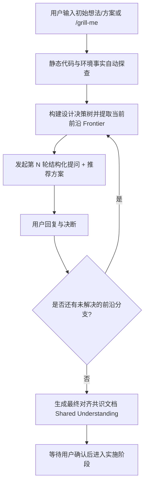

# Grill-Me: 深度设计与架构对齐面试技能 (Interactive Grilling Protocol)

本技能用于在正式编写代码或实施方案前，对方案、架构决策、边界条件与关键取舍进行**结构化、穿透式的连续面试提问 (Grilling)**，消除隐性假设，确保 Agent 与架构师/用户达成 100% 的深度共识。

---

## 1. 核心理念与机制 (Core Philosophy)

1. **设计决策树 (Design Tree)**：
   将任务拆解为树状决策网络，每个核心决策派生出子决策。
2. **决策前沿 (The Frontier)**：
   仅对“前置依赖已经敲定”的节点发起提问。绝不让用户在前提条件未定时猜测下游细节。
3. **分轮提问 (Rounds)**：
   每一轮将当前处于前沿（Frontier）的所有未决问题一并提出（通常 1~4 个），每题附带**明确的架构推荐答案 (Recommended Answer)**，用户只需回复序号或简短确认即可高效推进。
4. **事实探查 vs. 人工决策 (Facts vs. Decisions)**：
   - **环境事实 (Facts)**：对于已有代码库或环境可直接验证的信息（如接口签名、依赖版本、历史配置），Agent 自行通过工具检索探查，严禁向用户提问已有事实。
   - **架构决策 (Decisions)**：涉及业务目标、风控偏好、边界妥协与技术路线选择的决策，必须由用户决断。

---

## 2. 问答轮次规范格式 (Standard Round Format)

每轮提问必须严格遵循以下 Markdown 结构：

```markdown
### 🎯 第 {N} 轮面试提问 (Round {N} Frontier)

❓ **Q1** - **<问题标题>**: <清晰阐述问题背景、边界矛盾及备选方案 A/B/C>

➡️ **推荐方案**: <架构师推荐选项及 1~2 句话核心技术理由>

---

❓ **Q2** - **<问题标题>**: <清晰阐述问题背景、边界矛盾及备选方案 A/B/C>

➡️ **推荐方案**: <架构师推荐选项及 1~2 句话核心技术理由>
```

> **用户交互指引**：
> 用户可以通过极简方式回复（例如：“1 选 A，2 同意推荐，3 补充说明...”），Agent 接收后即可立即展开下一轮前沿推进。

---

## 3. 面试流程生命周期 (Interview Lifecycle)



### 步骤 1：事实探查 (Fact Discovery)
- 启动时，先使用只读工具（`grep_search`, `view_file` 等）快速扫描相关代码，掌握上下文，避免提出低级或已有现成答案的问题。

### 步骤 2：推进决策前沿 (Work the Frontier)
- 每一轮提出所有前置已满足的决策问题。
- 每道题必须给出明确的 `➡️ 推荐方案`，降低用户的认知负荷。

### 步骤 3：收敛与共识确认 (Shared Understanding)
- 当决策树的所有分支前沿均已清空（无未决问题）时，退出问答循环。
- 输出结构化的《技术实施共识总结 (Shared Understanding)》，包括：
  1. **核心目标与范围**
  2. **关键架构决断清单**
  3. **边界异常与风控处理规则**
  4. **推荐实施步骤**
- 提示用户确认后方可进入代码编写。
