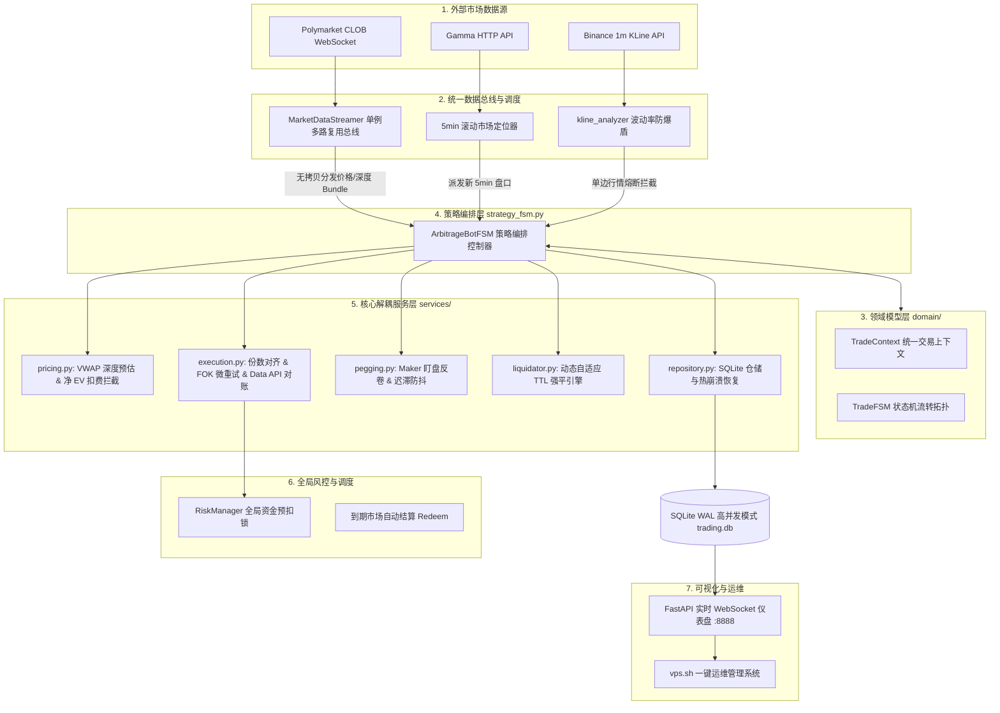

# Polymarket FSM Arbitrage Bot 🚀

基于 **Finite State Machine (有限状态机)** 驱动的 Polymarket 5 分钟 Up/Down 预测市场高频对称套利与做市量化系统。全异步并发多路复用总线、毫秒级 OrderBook VWAP 深度预估、双腿套利锁利数学拦截器、动态自适应 TTL 强平引擎（Adaptive TTL）与智能 Maker 动态盯盘追单（Order Pegging），在极短时间窗口内无损榨取预测市场的确定性对冲差价 (EV)。

---

## 🏛️ 系统全局逻辑架构 (System Architecture)




---

## 🌟 核心量化机制与技术亮点

### 1. 状态机驱动的订单生命周期 (TradeFSM)
所有交易在状态机内严格按单向事件驱动流转，彻底告别旧版阻塞式轮询：
```
[IDLE 监听] 
   │
   ├─► 双挂做市 (Maker-Maker) ─► [PENDING_BOTH_LEGS] ──► 双边均成交 ──► [LOCKED 零暴露完美套利]
   │                                  │
   │                                  ├─► 单边先成交 ──► [PENDING_LEG2 等待二腿 + 启动 90s TTL]
   │                                  │
   │                                  └─► 临期未成交 (≤30s) ──► 原子撤单 + 释放锁 ──► [FAILED 安全退出]
   │
   ├─► 单腿吃单 (Taker-Maker) ─► [PENDING_LEG1] ─► 成交 ──► [LEG1_ONLY 单腿敞口]
   │                                                       │
   │   ┌───────────────────────────────────────────────────┘
   │   ├─► 满足对冲阈值 (Net EV > 0) ─► [PENDING_LEG2] ─► 成交 ─► [LOCKED 锁仓套利]
   │   │                                  │
   │   │                                  ├─► 盘口上移 ─► [Maker 动态钉盘撤改单]
   │   │                                  └─► 超时/未成交 ─► 智能降级/吃单强平
   │   │
   │   └─► 超过动态自适应 TTL ─► 先撤二腿挂单 ─► FOK+GTC双重兜底平仓 ─► [FAILED 止损退出]
   │
   └─► 盘口到期 ─► [SETTLED 自动结算 Redeem]
```

### 2. 双腿并发限价挂单做市 (Dual-GTC Bracket Maker)
针对 `maker_maker` 类做市策略，系统支持通过 CLOB V2 的 `/batch-orders` 接口**原子级并发双挂**：
* **互补保利定价**：$\text{YES}_{\text{bid}} = \text{买一} + 0.001$，$\text{NO}_{\text{bid}} = 1.0 - \text{YES}_{\text{bid}} - 1.5\%$，组合成本压制在 $0.985$ 锁定纯利。
* **0% Maker 零手续费**：彻底免去 1% Taker 吃单费，毛利润 100% 留存。
* **秒级双吃与 90s TTL 容灾**：若双腿被瞬时插针吃满，直接无单边暴露达成套利；若单边先被吃，立即无缝转入 `PENDING_LEG2` 并启动 90s 强平防护；若临近交割未成交，原子撤单并 100% 释放风控锁。

### 3. 幻象失败防御与 Data API 终极对账防线
* **OrderID 异常深度捕获**：在遇到 HTTP 400（FOK killed）或 401 鉴权抖动时，底层强制解析出撮合层 `orderID` 返回 `UNCONFIRMED` 态，拒绝直接丢单。
* **公共免签名 Data API 查单**：在 REST 查询超时（>15s）后，自动向公共 Data API (`/trades?user=`) 对账链上真实成交，彻底根绝“链上已成交但被代码误判为失败”的单边裸仓风险。

### 4. 动态自适应强平引擎 (Adaptive TTL)
针对单边库存敞口风险（`LEG1_ONLY`），系统引入多维动态 TTL 调节机制：
* **行情平稳期**：维持基础 `90s`，给二腿挂单留出充足的对手盘撮合与吃单回落时间。
* **高波动联动收紧**：当 K 线振幅接近阈值警戒线（≥70%）时，动态将 TTL 压缩至 `35s ~ 60s` 提前强平逃命。
* **临期截断**：距离到期交割不足 `60s` 时，强制截断至 `max(15s, time_to_expiry - 10s)`，确保在交割前完成离场。
* **单调递减防抖动 (Monotonic TTL)**：持仓期间 TTL 只允许变短，绝不反向延长，彻底消除临界振荡导致的误强平。
* **FOK + GTC 双重止损兜底**：强平前先撤二腿挂单，随后发送市价 FOK 平仓；若 FOK 快速确认未成交，自动以 `GTC @ 0.99` 紧急挂单兜底，杜绝单边遗弃。

### 5. 多品种分资产 K 线波动率过滤 (Choppy Market Filter)
* **分品种专属阈值**：
  * **BTC**：10m 振幅上限 `0.30%`，净位移上限 `0.20%`；
  * **ETH**：10m 振幅上限 `0.45%`，净位移上限 `0.30%`（自适应更大波动）。
* 精确识别大单边趋势并主动拦截入场，在震荡回归后自动恢复监控（不永久拉黑）。

### 6. 真实手续费精确分摊与高保真模拟盘
* **精准分腿核算**：`Net EV = Guaranteed_Payout - Total_Spent - Fee_Leg1 - Fee_Leg2`，根据 Taker (FOK: 1.0%) 与 Maker (GTC: 0.0%) 独立匹配真实费率。
* **高保真仿真环境**：模拟盘告别 100% 完美成交与零滑点假象，内置基础成交率判定 (65%)、随机网络延迟 (100~300ms) 与动态滑点 (0~0.3%)，让回测与模拟表现高度契合实盘。

### 7. 智能 Maker 动态防卷机制 (Anti-Pennying War)
* 处于二腿挂单等待期间，系统在被压价后自动触发 **1.5s~3.5s 随机装死迟滞**，过滤对手高频假动作。
* 装死期满若确需追击，采用 **0.002~0.004 阶梯式跳跃反卷**，节省 API 限流配额并增强排位稳定性。

---

## 📊 策略矩阵说明 (`configs/strategies.json`)

系统内置多组异构策略并行运行，覆盖不同行情风格：

| 策略 ID | 策略模式 | 首腿入场 | 二腿补仓 | 核心特性 |
| :--- | :--- | :--- | :--- | :--- |
| `taker_maker_conservative` | 吃单 + 挂单 | ≤ 0.45 | 智能反卷 | 首腿吃单，二腿以阶梯跃迁防卷挂单赚 Spread |
| `taker_maker_standard` | 吃单 + 挂单 | ≤ 0.50 | 智能反卷 | 拥抱长尾市场，兼顾 OBI 风控与高盈亏比 |
| `taker_maker_aggressive` | 吃单 + 挂单 | ≤ 0.55 | 智能反卷 | 激进型 Taker-Maker，快速建仓吃波段 |
| `maker_maker_conservative` | 挂单 + 挂单 | ≤ 0.45 | 双边并发挂单 | **原子双挂 (Dual Bracket)**，0% 费率且无滑点磨损 |
| `maker_maker_standard` | 挂单 + 挂单 | ≤ 0.50 | 双边并发挂单 | **原子双挂 (Dual Bracket)**，拥抱长尾盘口深度 |

> **提示**: 架构已彻底废弃高磨损且天然易滑点的纯双边 Taker 模式，全面拥抱 Taker-Maker 与 Maker-Maker。

---

## 🛠️ 安装与快速上手

### 1. 本地 / 开发环境启动
```bash
# 1. 安装依赖
pip install -r requirements.txt

# 2. 配置环境变量
cp configs/.env.example .env
# 编辑 .env 填入私钥与 API 配置

# 3. 启动 Dashboard 仪表盘
# Linux / macOS / VPS:
PYTHONPATH=src python3 -m polymarket.apps.dashboard

# Windows (PowerShell / CMD):
$env:PYTHONPATH="src"; python -m polymarket.apps.dashboard
# 或直接在项目根目录下执行:
python -m polymarket.apps.dashboard
```

### 2. VPS 云端一键运维 (Ubuntu 22.04 / 24.04 推荐)
仓库自带开箱即用的自动化管理脚本 `vps.sh`：

```bash
# 一键初始化环境并后台启动
bash vps.sh

# 常用运维指令
bash vps.sh update     # 拉取 GitHub 最新代码、更新依赖并平滑重启
bash vps.sh restart    # 重启当前服务
bash vps.sh stop       # 安全停止后台服务
bash vps.sh status     # 查看服务运行状态与 PID
bash vps.sh logs       # 查看实时运行日志 (等同于 tail -f logs/nohup.log)
```

启动成功后，在浏览器中访问 `http://<你的IP>:8888` 即可进入实时量化大盘。

---

## ⚙️ 关键配置项详解 (`.env` / `config.py`)

| 变量名 | 类型 | 默认值 | 描述 |
| :--- | :--- | :--- | :--- |
| `ORDER_AMOUNT` | float | `10.0` | 单笔交易头寸基础金额 (USDC) |
| `MAX_SLIPPAGE_TOLERANCE` | float | `0.015` | 最大允许 VWAP 滑点比例 (1.5%) |
| `BTC_CHOP_MAX_AMPLITUDE` | float | `0.30` | Binance BTC 10m K线振幅熔断阈值 (0.30%) |
| `ETH_CHOP_MAX_AMPLITUDE` | float | `0.45` | Binance ETH 10m K线振幅熔断阈值 (0.45%) |
| `LEG1_MAX_UNHEDGED_SECONDS`| int | `90` | 首腿最大未对冲基础持有时间 (秒)，结合波动率自适应收紧 |
| `TAKER_FEE_RATE` | float | `0.01` | Taker 吃单手续费率 (1.0%) |
| `MAKER_FEE_RATE` | float | `0.00` | Maker 挂单手续费率 (0.0%) |
| `SIM_BASE_FILL_RATE` | float | `0.65` | 模拟盘 FOK 基础成交率 (65%) |
| `SIM_LATENCY_MIN_MS` | int | `100` | 模拟盘最小网络延迟 (ms) |
| `SIM_LATENCY_MAX_MS` | int | `300` | 模拟盘最大网络延迟 (ms) |
| `SIM_SLIPPAGE_MAX` | float | `0.003` | 模拟盘最大随机价格滑点 (0.3%) |
| `MAX_CONCURRENT_UNHEDGED_TRADES`| int | `3` | 全账户最大允许同时存在的单腿敞口数 |
| `INITIAL_CAPITAL` | float | `100.0` | 初始资金底数 (用于回撤与熔断计算) |
| `MIN_CASH_RESERVE_PCT` | float | `0.20` | 最低现金保留比例 (20%) |

---

## ⚠️ 免责声明 (Disclaimer)

本项目仅供算法交易、量化对冲及区块链高频交易的技术研究与学习交流。预测市场价格波动剧烈，任何策略均存在单边行情被套、网络延迟及流动性缺失等风险。使用本系统造成的任何实际盈亏均由使用者本人承担。