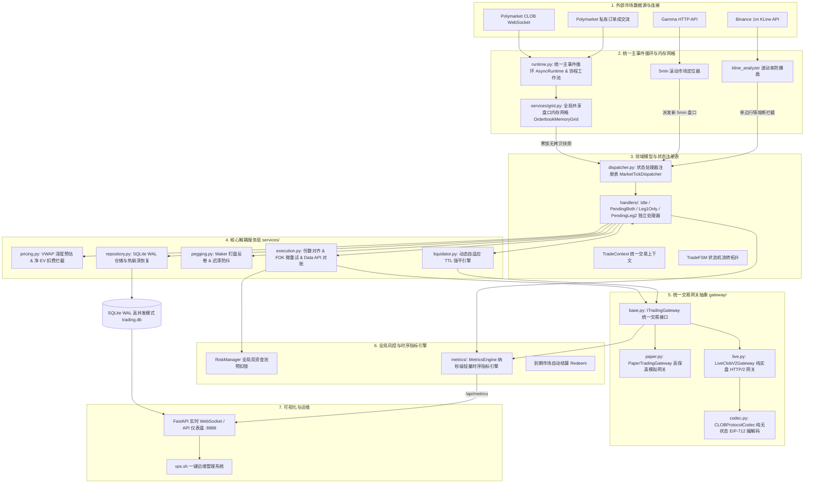

# Polymarket FSM Arbitrage Bot 🚀

基于 **Finite State Machine (有限状态机)** 与 **高性能量化组件化架构** 驱动的 Polymarket 5 分钟 Up/Down 预测市场高频对称套利与做市量化系统。全异步统一主事件循环、全局共享盘口内存网格、纯无状态 EIP-712 协议网关编解码、微秒级 OrderBook VWAP 深度预估、双腿套利锁利数学拦截器、动态自适应 TTL 强平引擎（Adaptive TTL）与智能 Maker 动态盯盘追单（Order Pegging），在极短时间窗口内无损榨取预测市场的确定性对冲差价 (EV)。

---

## 🏛️ 系统全局逻辑架构 (System Architecture)



---

## 🌟 核心量化机制与技术亮点

### 1. 状态处理器架构模式 (State Handlers Pattern)
系统采用 **状态处理器模式** 解耦传统庞大的单体状态机循环，由 [`MarketTickDispatcher`](file:///d:/生活/Trading/polymarket/src/polymarket/services/handlers/dispatcher.py) 基于当前状态进行 $O(1)$ 路由分发：
- **`IdleTickHandler`**：开仓扫描、K线防爆盾校验、Top 5 档 OBI 深度失衡过滤（$OBI \ge -0.40$ 且 $\sum Shares \ge 30$）与入场分流；
- **`PendingBothLegsTickHandler`**：双挂做市推进；双边成交立即进入 `LOCKED`；**单腿被吃时立即撤销反向单并流转至 `LEG1_ONLY` 触发 OCO 双向自适应变现**；
- **`Leg1OnlyTickHandler`**：首腿成交份数绝对对齐，并发挂出【同向做 T 限价卖单】与【反向配对限价买单】（`dual_exit` 模式），启动 **35s 连续幂律平滑加速让价阶梯**；
- **`PendingLeg2TickHandler`**：二腿 OCO 变现裁决、成交真实 Net EV 损益核算、Maker 挂单反卷 (Anti-Pennying) 与阶梯跃迁跟单。

### 2. OBI 深度失衡守门与连续幂律让价 (OBI Gate & Power-law Decay)
- **Top 5 档 OBI 深度压迫拦截**：穿透订单簿买卖盘前 5 档计算 $OBI = \frac{V_{\text{bid}} - V_{\text{ask}}}{V_{\text{bid}} + V_{\text{ask}}}$。设置 $\sum Shares \ge 30.0$ 防早盘冷启动误杀门槛，当 $OBI < -0.40$（卖压泰山压顶）时主动拦截 Taker 入场。
- **连续幂律加速平滑让价阶梯**：
  $$\text{CurrentMargin}(t) = \text{InitialMargin} - \left(\frac{t}{T}\right)^{1.8} \times (\text{InitialMargin} - \text{MinMargin})$$
  在 35s 内实现前期平稳赚利、后期加速保本脱手，底线强锁 $\text{Net EV} \ge 0$，彻底杜绝超时打损。

### 3. 全局共享盘口内存网格 (Orderbook Memory Grid)
- **`OrderbookMemoryGrid` 单例**：单例维护全市场 L2 集中式内存订单簿；
- **Lock-Free 零锁只读快照**：策略读取盘口直接获取不可变强类型快照 `OrderbookSnapshot`，耗时 `<1微秒`；
- **本地 0 网络 I/O 穿透 VWAP 强平**：TTL 强平触发时，直接利用本地盘口网格秒算买盘 VWAP 均价，平仓响应延迟从 200ms 降至 `<0.05ms`，彻底杜绝 429 API 限流。

### 4. 统一交易网关抽象 (Unified Trading Gateway)
- **`CLOBProtocolCodec`**：纯无状态协议编解码器，提供 5.0 Shares 最小门槛安全钳制、价格边界截断与纯原生 EIP-712 内存签名；
- **`PaperTradingGateway`**：高保真模拟网关，内置模拟挂单生命周期账本，注入真实网络延迟 (100~300ms) 与价格滑点 (0~0.3%)；
- **`LiveClobV2Gateway`**：纯实盘 CLOB V2 网关，支持 HTTP/2 多路复用、401 动态重签自愈、撮合异常提取 OrderID 防幻象失败与免签 Data API 终极对账防线；
- **`PolyClient` 门面**：轻量级 Facade 门面全量透明代理，保持 100% 向后兼容。

### 5. 链上智能合约自动结算与风控额度闭环 (On-Chain CTF Redeem)
- **Polygon CTF 官方合约原生赎回**：统一由 `OnChainRedeemer` 直接向 Polygon 主网 `ConditionalTokens` 官方合约调用 `redeemPositions`，配置多候选 RPC 轮询与 **35 Gwei 最低 Gas 保底**；
- **风控额度全生命周期闭环**：链上赎回后联动触发 FSM `settle_market` 流转至 `SETTLED`，在 `finally` 块中强制归还额度，彻底杜绝小本金实盘账户额度假死。

### 6. 动态自适应强平引擎与全量撤单防御 (Adaptive TTL & Liquidation)
- **高波动联动收紧**：根据 K 线振幅动态将 TTL 压缩至 `35s ~ 60s` 提前强平逃命；
- **临期截断与单调递减**：持仓期间 TTL 只允许变短，绝不反向延长；
- **全量撤单防孤儿单**：强平时统一撤销 `leg2_order_id` 与 `dual_orders` 中所有挂单并做独立异常隔离，随后发送市价 FOK 平仓，杜绝平仓后原买单被吃产生单边孤儿仓位。

---

## 📊 策略矩阵说明 (`configs/strategies.json`)

系统内置多组异构策略并行运行，覆盖不同行情风格：

| 策略 ID | 策略模式 | 首腿入场 | 出场机制 | 核心特性 |
| :--- | :--- | :--- | :--- | :--- |
| `taker_maker_conservative` | 吃单 + 挂单 | ≤ 0.42 | dual_exit OCO | **实盘主力 (3U 起步)**，低入场价保护，35s 幂律平滑让价脱手 |
| `taker_maker_standard` | 吃单 + 挂单 | ≤ 0.45 | dual_exit OCO | 拥抱长尾市场，兼顾 OBI 深度风控与全盘口净 EV 套利 |
| `taker_maker_aggressive` | 吃单 + 挂单 | ≤ 0.48 | dual_exit OCO | 高敏型 Taker-Maker，全盘口流动性快速捕捉 |
| `maker_maker_conservative` | 挂单 + 挂单 | ≤ 0.45 | dual_exit OCO | **双边并发做市**，单腿被吃立即转入 OCO 快速脱手，0% 费率 |
| `maker_maker_standard` | 挂单 + 挂单 | ≤ 0.50 | dual_exit OCO | **双边并发做市**，深度参与 5min 盘口做市与做 T 变现 |

---

## 🛠️ 安装与快速上手

### 1. 本地 / 开发环境启动
```bash
# 1. 安装依赖
pip install -r requirements.txt

# 2. 配置环境变量
cp configs/.env.example .env
# 编辑 .env 填入私钥与 API 配置

# 3. 运行自动化单元测试套件 (135 项测试 100% 绿灯通过)
python -m pytest tests/

# 4. 启动 Dashboard 仪表盘
python -m polymarket.apps.dashboard
```

### 2. 敏捷发布流水线 (Agile Release Pipeline)
本地开发调试完毕并通过 135 项全量测试后，可通过敏捷流水线实现秒级一键发布与 VPS 热更新：

```bash
# 自动执行【回归测试 -> 中文 Commit -> Push -> 远程调用 VPS POST /api/ops/update 免登录秒级热更】
python scripts/vps_ops.py release "feat: 中文提交说明"

# 常用运维指令
python scripts/vps_ops.py status         # 查看远程 VPS 运行大盘与各策略盈亏
python scripts/vps_ops.py logs -n 50     # 查看远程 VPS 实时运行日志流
```

启动成功后，在浏览器中访问 `http://<你的IP>:8888` 即可进入实时量化大盘。
---

## ⚙️ 关键配置项详解 (`.env` / `config.py`)

| 变量名 | 类型 | 默认值 | 描述 |
| :--- | :--- | :--- | :--- |
| `ORDER_AMOUNT` | float | `10.0` | 单笔交易头寸基础金额 (USDC) |
| `MAX_SLIPPAGE_TOLERANCE` | float | `0.015` | 最大允许 VWAP 滑点比例 (1.5%) |
| `BTC_CHOP_MAX_AMPLITUDE` | float | `0.30` | Binance BTC 10m K线振幅熔断阈值 (0.30%) |
| `ETH_CHOP_MAX_AMPLITUDE` | float | `0.45` | Binance ETH 10m K线振幅熔断阈值 (0.45%) |
| `LEG1_MAX_UNHEDGED_SECONDS`| int | `90` | 首腿最大未对冲基础持有时间 (秒)，结合波动率自适应收紧 |
| `TAKER_FEE_RATE` | float | `0.01` | Taker 吃单手续费率 (1.0%) |
| `MAKER_FEE_RATE` | float | `0.00` | Maker 做市手续费率 (0.0%) |
| `SIGNATURE_TYPE` | int | `0` | 钱包签名类型 (0: EOA, 1: Polymarket Proxy, 2: Gnosis Safe) |