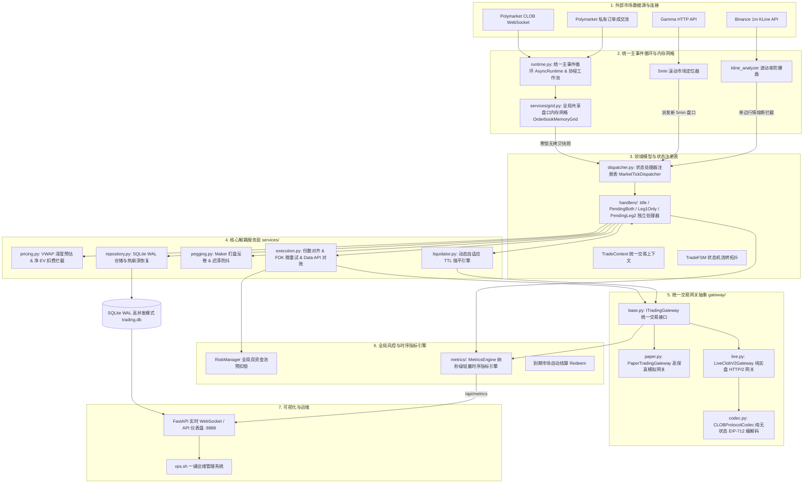

# Polymarket FSM Arbitrage Bot 🚀

基于 **Finite State Machine (有限状态机)** 与 **高性能量化组件化架构** 驱动的 Polymarket 5 分钟 Up/Down 预测市场高频对称套利与做市量化系统。全异步统一主事件循环、全局共享盘口内存网格、纯无状态 EIP-712 协议网关编解码、微秒级 OrderBook VWAP 深度预估、双腿套利锁利数学拦截器、动态自适应 TTL 强平引擎（Adaptive TTL）与智能 Maker 动态盯盘追单（Order Pegging），在极短时间窗口内无损榨取预测市场的确定性对冲差价 (EV)。

---

## 🏛️ 系统全局逻辑架构 (System Architecture)



---

## 🌟 核心量化机制与技术亮点

### 1. 状态处理器架构模式 (State Handlers Pattern)
系统采用 **状态处理器模式** 解耦传统庞大的单体状态机循环，由 [`MarketTickDispatcher`](file:///d:/生活/Trading/polymarket/src/polymarket/services/handlers/dispatcher.py) 基于当前状态进行 $O(1)$ 路由分发：
- **`IdleTickHandler`**：开仓扫描、K线防爆盾校验、OBI 不平衡度过滤与入场分流；
- **`PendingBothLegsTickHandler`**：双挂限价做市单成交推进、单边成交转入与临期撤单；
- **`Leg1OnlyTickHandler`**：首腿成交份数绝对对齐、反向做市挂单与启动自适应 TTL 强平；
- **`PendingLeg2TickHandler`**：二腿挂单做市反卷 (Anti-Pennying) 与阶梯跃迁跟单。

### 2. 统一主事件循环与协程工作池 (Unified Event Loop & Pool)
- **`AsyncRuntime` 单例**：全局维护单一长寿命事件循环，杜绝了“每市场独立线程 + 短命 Loop”的反模式；
- **`BoundedDropOldestQueue` 背压队列**：高频盘口更新时丢弃过时旧帧、保留最新快照，彻底消灭内存积压；
- **`MarketTaskSupervisor` 任务监管器**：维护任务强引用防止 GC 意外回收，捕获异常秒级推流至 Dashboard，保障后台任务 100% 存活。

### 3. 全局共享盘口内存网格 (Orderbook Memory Grid)
- **`OrderbookMemoryGrid` 单例**：单例维护全市场 L2 集中式内存订单簿；
- **Lock-Free 零锁只读快照**：策略读取盘口直接获取不可变强类型快照 `OrderbookSnapshot`，耗时 `<1微秒`；
- **本地 0 网络 I/O 穿透 VWAP 强平**：90s TTL 强平触发时，直接利用本地盘口网格秒算买盘 VWAP 均价，平仓响应延迟从 200ms 降至 `<0.05ms`，彻底杜绝 429 API 限流。

### 4. 统一交易网关抽象 (Unified Trading Gateway)
- **`CLOBProtocolCodec`**：纯无状态协议编解码器，提供 5.0 Shares 最小门槛安全钳制、价格边界截断与纯原生 EIP-712 内存签名；
- **`PaperTradingGateway`**：高保真模拟网关，内置模拟挂单生命周期账本，注入真实网络延迟 (100~300ms) 与价格滑点 (0~0.3%)；
- **`LiveClobV2Gateway`**：纯实盘 CLOB V2 网关，支持 HTTP/2 多路复用、401 动态重签自愈、撮合异常提取 OrderID 防幻象失败与免签 Data API 终极对账防线；
- **`PolyClient` 门面**：轻量级 Facade 门面全量透明代理，保持 100% 向后兼容。

### 5. 轻量级内部时序指标引擎 (Lightweight Metrics Engine)
- **纯内存微秒级打点**：不依赖任何笨重外部库，单次打点耗时 `<100 纳秒`；
- **核心指标矩阵**：实时追踪 `poly_order_latency_seconds` (P50/P90/P99 下单往返延迟直方图)、`poly_tick_process_latency_seconds` (Tick 处理耗时)、`poly_trades_locked_total` (锁利成交数)、`poly_liquidations_total` (强平发生数)；
- **`metrics.timer` 双模计时器**：支持 `with` 与 `async with` 一行代码自动捕获毫秒级延迟；
- **Dashboard JSON 接口**：暴露 `GET /api/metrics` 供前端看板绘制实时性能与交易时序图表。

### 6. 双腿并发限价挂单做市 (Dual-GTC Bracket Maker)
针对 `maker_maker` 类做市策略，系统支持通过 CLOB V2 的 `/batch-orders` 接口**原子级并发双挂**：
* **互补保利定价**：$\text{YES}_{\text{bid}} = \text{买一} + 0.001$，$\text{NO}_{\text{bid}} = 1.0 - \text{YES}_{\text{bid}} - 1.5\%$，组合成本压制在 $0.985$ 锁定纯利。
* **0% Maker 零手续费**：彻底免去 1% Taker 吃单费，毛利润 100% 留存。
* **秒级双吃与 90s TTL 容灾**：若双腿被瞬时插针吃满，直接无单边暴露达成套利；若单边先被吃，立即无缝转入 `PENDING_LEG2` 并启动 90s 强平防护；若临近交割未成交，原子撤单并 100% 释放风控锁。

### 7. 动态自适应强平引擎 (Adaptive TTL)
针对单边库存敞口风险（`LEG1_ONLY`），系统引入多维动态 TTL 调节机制：
* **行情平稳期**：维持基础 `90s`，给二腿挂单留出充足的对手盘撮合与吃单回落时间。
* **高波动联动收紧**：当 K 线振幅接近阈值警戒线（≥70%）时，动态将 TTL 压缩至 `35s ~ 60s` 提前强平逃命。
* **临期截断**：距离到期交割不足 `60s` 时，强制截断至 `max(15s, time_to_expiry - 10s)`，确保在交割前完成离场。
* **单调递减防抖动 (Monotonic TTL)**：持仓期间 TTL 只允许变短，绝不反向延长，彻底消除临界振荡导致的误强平。
* **FOK + GTC 双重止损兜底**：强平前先撤二腿挂单，随后发送市价 FOK 平仓；若 FOK 快速确认未成交，自动以 `GTC @ 0.99` 紧急挂单兜底，杜绝单边遗弃。

---

## 📊 策略矩阵说明 (`configs/strategies.json`)

系统内置多组异构策略并行运行，覆盖不同行情风格：

| 策略 ID | 策略模式 | 首腿入场 | 二腿补仓 | 核心特性 |
| :--- | :--- | :--- | :--- | :--- |
| `taker_maker_conservative` | 吃单 + 挂单 | ≤ 0.45 | 智能反卷 | 首腿吃单，二腿以阶梯跃迁防卷挂单赚 Spread |
| `taker_maker_standard` | 吃单 + 挂单 | ≤ 0.50 | 智能反卷 | 拥抱长尾市场，兼顾 OBI 风控与高盈亏比 |
| `taker_maker_aggressive` | 吃单 + 挂单 | ≤ 0.55 | 智能反卷 | 激进型 Taker-Maker，快速建仓吃波段 |
| `maker_maker_conservative` | 挂单 + 挂单 | ≤ 0.45 | 双边并发挂单 | **原子双挂 (Dual Bracket)**，0% 费率且无滑点磨损 |
| `maker_maker_standard` | 挂单 + 挂单 | ≤ 0.50 | 双边并发挂单 | **原子双挂 (Dual Bracket)**，拥抱长尾盘口深度 |

---

## 🛠️ 安装与快速上手

### 1. 本地 / 开发环境启动
```bash
# 1. 安装依赖
pip install -r requirements.txt

# 2. 配置环境变量
cp configs/.env.example .env
# 编辑 .env 填入私钥与 API 配置

# 3. 运行自动化单元测试套件 (119 项测试 100% 通过)
python -m pytest tests/

# 4. 启动 Dashboard 仪表盘
# Linux / macOS / VPS:
PYTHONPATH=src python3 -m polymarket.apps.dashboard

# Windows (PowerShell / CMD):
$env:PYTHONPATH="src"; python -m polymarket.apps.dashboard
# 或直接在项目根目录下执行:
python -m polymarket.apps.dashboard
```

### 2. VPS 云端一键运维 (Ubuntu 22.04 / 24.04 推荐)
仓库自带开箱即用的自动化管理脚本 `vps.sh`：

```bash
# 一键初始化环境并后台启动
bash vps.sh

# 常用运维指令
bash vps.sh update     # 拉取 GitHub 最新代码、更新依赖并平滑重启
bash vps.sh restart    # 重启当前服务
bash vps.sh stop       # 安全停止后台服务
bash vps.sh status     # 查看服务运行状态与 PID
bash vps.sh logs       # 查看实时运行日志 (等同于 tail -f logs/nohup.log)
```

启动成功后，在浏览器中访问 `http://<你的IP>:8888` 即可进入实时量化大盘，调用 `http://<你的IP>:8888/api/metrics` 即可获取结构化性能与交易时序指标。

---

## ⚙️ 关键配置项详解 (`.env` / `config.py`)

| 变量名 | 类型 | 默认值 | 描述 |
| :--- | :--- | :--- | :--- |
| `ORDER_AMOUNT` | float | `10.0` | 单笔交易头寸基础金额 (USDC) |
| `MAX_SLIPPAGE_TOLERANCE` | float | `0.015` | 最大允许 VWAP 滑点比例 (1.5%) |
| `BTC_CHOP_MAX_AMPLITUDE` | float | `0.30` | Binance BTC 10m K线振幅熔断阈值 (0.30%) |
| `ETH_CHOP_MAX_AMPLITUDE` | float | `0.45` | Binance ETH 10m K线振幅熔断阈值 (0.45%) |
| `LEG1_MAX_UNHEDGED_SECONDS`| int | `90` | 首腿最大未对冲基础持有时间 (秒)，结合波动率自适应收紧 |
| `TAKER_FEE_RATE` | float | `0.01` | Taker 吃单手续费率 (1.0%) |
| `MAKER_FEE_RATE` | float | `0.00` | Maker 做市手续费率 (0.0%) |
| `SIGNATURE_TYPE` | int | `0` | 钱包签名类型 (0: EOA, 1: Polymarket Proxy, 2: Gnosis Safe) |