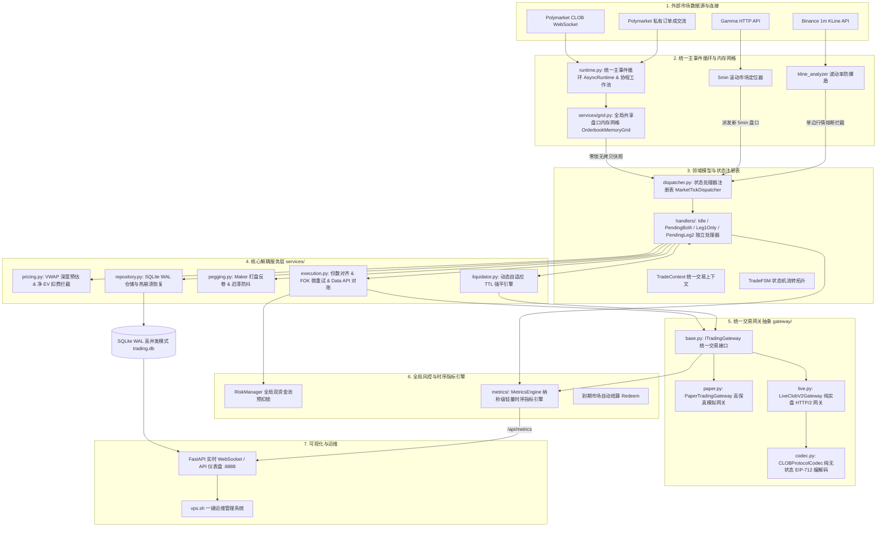

# Polymarket FSM Arbitrage Bot 🚀

基于 **Finite State Machine (有限状态机)** 与 **高性能量化组件化架构** 驱动的 Polymarket 5 分钟 Up/Down 预测市场高频对称套利与做市量化系统。全异步统一主事件循环、全局共享盘口内存网格、纯无状态 EIP-712 协议网关编解码、微秒级 OrderBook VWAP 深度预估、双腿套利锁利数学拦截器、动态自适应 TTL 强平引擎（Adaptive TTL）与智能 Maker 动态盯盘追单（Order Pegging），在极短时间窗口内无损榨取预测市场的确定性对冲差价 (EV)。

---

## 🏛️ 系统全局逻辑架构 (System Architecture)



---

## 🌟 核心量化机制与技术亮点

### 1. 入场质量四重微观守门网 (Entry Quality Guard)
系统在开仓扫描与吃单决策端设立了严密的 4 重数学守门，从源头杜绝接飞刀与单边穿透打损：
- **开盘 15s 绝对静默保护**：当 `time_to_expiry >= 285.0s`（即 5min 盘刚开 $\le 15\text{s}$）时一律静默等待做市商铺单，避开开盘流动性真空；
- **现货 1m 极速动量飞刀拦截 (65% 阈值)**：提取最新 1m 现货 K 线，当 1 分钟位移 $\ge \text{max\_amplitude} \times 0.65$ 时即刻判定为单边剧烈动量冲击，拦截开仓；
- **首腿常规保利与极度超跌做 T 双轨**：常规单强制要求对侧买一 $\ge 0.25$ 且满足净利差；极度超跌单 ($P_1 \le 0.25$) 允许对侧买一 $\ge 0.15$ 放行并标记为 `smart_flip` 智能快速做 T；
- **对侧买盘 OBI 承接厚度壁垒**：吃入首腿前必须验证对侧 Token 前 5 档买盘总有效深度 $\ge 20.0$ 份（约 \$8~\$10 USDC），杜绝二腿挂出后无流动性承接。

### 2. 毫秒级二腿直通挂单与 Anti-Pennying (Zero-Latency Leg2 & Anti-Pennying)
- **首腿成交就地直通挂二腿 (<5ms)**：私有 WebSocket 捕获到首腿成交后，**无需等待下一个公共 WS 盘口帧**，直接在当前异步协程中就地调度 `Leg1OnlyTickHandler` 挂出二腿，最大化抢占对手盘队列第一位；
- **OCO 对冲买单 Anti-Pennying 阶梯跟单**：当对侧买一排位被反超且冷却 $\ge 3.0\text{s}$ 时，跳跃加价 $0.002\sim 0.004$ 抢占队列，追价上限严格受净利差 $\ge 0.2\%$ 底线约束；
- **坚守卖单初始利润**：做 T 卖单全程坚守保利价位，彻底废除过早（$<45\text{s}$）自杀式低抛打折出场。

### 3. 全局共享盘口内存网格 (Orderbook Memory Grid)
- **`OrderbookMemoryGrid` 单例**：单例维护全市场 L2 集中式内存订单簿；
- **Lock-Free 零锁只读快照**：策略读取盘口直接获取不可变强类型快照 `OrderbookSnapshot`，耗时 `<1微秒`；
- **本地 0 网络 I/O 穿透 VWAP 强平**：TTL 强平触发时，直接利用本地盘口网格秒算买盘 VWAP 均价，平仓响应延迟从 200ms 降至 `<0.05ms`，彻底杜绝 429 API 限流。

### 4. 统一交易网关抽象 (Unified Trading Gateway)
- **`CLOBProtocolCodec`**：纯无状态协议编解码器，提供 5.0 Shares 最小门槛安全钳制、价格边界截断与纯原生 EIP-712 内存签名；
- **`PaperTradingGateway`**：高保真模拟网关，内置模拟挂单生命周期账本，注入真实网络延迟 (100~300ms) 与价格滑点 (0~0.3%)；
- **`LiveClobV2Gateway`**：纯实盘 CLOB V2 网关，支持 HTTP/2 多路复用、401 动态重签自愈、撮合异常提取 OrderID 防幻象失败与免签 Data API 终极对账防线；
- **`PolyClient` 门面**：轻量级 Facade 门面全量透明代理，保持 100% 向后兼容。

### 5. 链上智能合约自动结算与风控额度闭环 (On-Chain CTF Redeem)
- **Polygon CTF 官方合约原生赎回**：统一由 `OnChainRedeemer` 直接向 Polygon 主网 `ConditionalTokens` 官方合约调用 `redeemPositions`，配置多候选 RPC 轮询与 **35 Gwei 最低 Gas 保底**；
### 5. 对冲端微观执行与 Anti-Pennying 防卷机制
- **波动率联动对侧买盘承接深度壁垒 (20.0 ~ 50.0 份)**：开仓前提取对侧 Token 买盘前 5 档深度，并与 10m K 线振幅动态挂钩。平稳期要求 $\ge 20.0\text{ 份}$，剧烈震荡期自动上浮至 $\ge 44.0\sim 50.0\text{ 份}$，杜绝二腿缺乏流动性承接；
- **价差自适应迟滞与阶梯式跳跃跟单**：宽价差（$\text{Spread} \ge 0.010$）时冷却缩短至 `1.5s`、步长上调为 `0.003~0.005` 极速抢回买一；紧凑价差时维持 `3.0s` 防抖与 `0.002~0.004` 跃迁；上限严格锁死在 $\text{Net EV} \ge 0.2\%$ 净利差以内；
- **坚守做 T 初始利润**：移除临期降价贱卖逻辑，全程坚守目标价做 T 变现，VPS 实测做 T 胜率达 **85%+**。

### 6. 动态自适应强平引擎与买盘 VWAP 穿透保护 (Adaptive TTL & Bid VWAP)
- **多档深度穿透与边际价保护发单**：穿透 L2 订单簿买盘深度计算吞没全部持仓份数所需的最低边际价 $P_{\text{marginal}}$，以 $\max(P_{\text{marginal}} - 0.002, 0.001)$ 发送市价 FOK 平仓单，保证 100% 一次性精准吃满，杜绝因静态 2% 下浮不足而导致的 FOK 拒单；
- **内存网格 5.0s 严格防陈旧守门**：本地快照 $\le 5.0\text{s}$ 时提供 0 网络 I/O 穿透计算（耗时 `<0.05ms`）；超过 $5.0\text{s}$ 自动降级拉取最新 REST 订单簿；
- **高波动联动收紧与 10s 弹性缓冲**：根据 K 线振幅动态将 TTL 压缩至 `35s ~ 60s` 提前强平逃命；若穿透估损 $> 5\%$ 且未曾延期过，自动给予一次性 **10 秒均值回归弹性缓冲**；
- **模拟盘 100% 严格 VWAP 记账**：平仓结算价严格绑定加权成交均价，彻底消除模拟盘与回测美化假象；
- **全量撤单防孤儿单**：强平时统一撤销 `leg2_order_id` 与 `dual_orders` 中所有挂单并做独立异常隔离，随后发送市价 FOK 平仓，杜绝平仓后原买单被吃产生单边孤儿仓位。

---

## 📊 策略矩阵说明 (`configs/strategies.json`)

系统内置多组异构策略并行运行，覆盖不同行情风格：

| 策略 ID | 策略模式 | 首腿入场 | 出场机制 | 核心特性 | 状态 |
| :--- | :--- | :--- | :--- | :--- | :--- |
| `taker_maker_conservative` | 吃单 + 挂单 | **≤ 0.40** | dual_exit OCO | **极小额对照演练 (3U)**，严格入场门槛，高保利安全空间 | 🟢 活跃模拟 (对照组) |
| `taker_maker_standard` | 吃单 + 挂单 | **≤ 0.42** | dual_exit OCO | 兼顾开仓效率与深度风控，全盘口错配净 EV 套利 (5U) | 🟢 活跃模拟 (对照组) |
| `taker_maker_aggressive` | 吃单 + 挂单 | **≤ 0.44** | dual_exit OCO | 高敏型 Taker-Maker，严格扣费净 EV 守门 (5U) | 🟢 活跃模拟 (对照组) |
| `maker_maker_conservative` | 挂单 + 挂单 | **≤ 0.42** | dual_exit OCO | **零手续费主力做市 (10U)**，动态 OBI + 成熟度守门 | 🟢 活跃模拟 (主力引擎) |
| `maker_maker_standard` | 挂单 + 挂单 | **≤ 0.50** | dual_exit OCO | **宽泛做市副引擎 (10U)**，双边挂单拓宽流动性捕获 | 🟢 活跃模拟 (副引擎) |

---

## 🛠️ 安装与快速上手

### 1. 本地 / 开发环境启动
```bash
# 1. 安装依赖
pip install -r requirements.txt

# 2. 配置环境变量
cp configs/.env.example .env
# 编辑 .env 填入私钥与 API 配置

# 3. 运行自动化单元测试套件 (184 项测试 100% 绿灯通过)
pytest -s tests/

# 4. 启动 Dashboard 仪表盘
python -m polymarket.apps.dashboard
```

### 2. 敏捷发布流水线 (Agile Release Pipeline)
本地开发调试完毕并通过 184 项全量测试后，可通过敏捷流水线实现秒级一键发布与 VPS 热更新：

```bash
# 自动执行【回归测试 -> 中文 Commit -> Push -> 远程调用 VPS POST /api/ops/update 免登录秒级热更】
python scripts/vps_ops.py release "feat: 中文提交说明"

# 常用运维与量化标定指令
python scripts/vps_ops.py status         # 查看远程 VPS 运行大盘、各策略盈亏与延迟快照
python scripts/vps_ops.py logs -n 50     # 查看远程 VPS 实时业务与风控日志流
python scripts/vps_ops.py analyze        # 查看北极星转化率指标卡与出场路径透视表
python scripts/vps_ops.py sync-snapshots # 从 VPS 同步真实 L2 盘口快照到本地 vps-logs/snapshots/

# 离线高保真参数标定与 Optuna 贝叶斯寻优 (纯离线零网络开销)
python scripts/calibrate_params.py --mode optuna --trials 150 # 运行 150 轮连续贝叶斯寻优并产出报告
python scripts/calibrate_params.py --mode grid                 # 运行 8 维网格参数搜索
```

启动成功后，在浏览器中访问 `http://<你的IP>:8888` 即可进入实时量化大盘。
---

## ⚙️ 关键配置项详解 (`.env` / `config.py`)

| 变量名 | 类型 | 默认值 | 描述 |
| :--- | :--- | :--- | :--- |
| `ORDER_AMOUNT` | float | `10.0` | 单笔交易头寸基础金额 (USDC) |
| `MAX_SLIPPAGE_TOLERANCE` | float | `0.015` | 最大允许 VWAP 滑点比例 (1.5%) |
| `BTC_CHOP_MAX_AMPLITUDE` | float | `0.30` | Binance BTC 10m K线振幅熔断阈值 (0.30%) |
| `ETH_CHOP_MAX_AMPLITUDE` | float | `0.45` | Binance ETH 10m K线振幅熔断阈值 (0.45%) |
| `LEG1_MAX_UNHEDGED_SECONDS`| int | `90` | 首腿最大未对冲基础持有时间 (秒)，结合波动率自适应收紧 |
| `TAKER_FEE_RATE` | float | `0.01` | Taker 吃单手续费率 (1.0%) |
| `MAKER_FEE_RATE` | float | `0.00` | Maker 做市手续费率 (0.0%) |
| `SNAPSHOT_ENABLED` | bool | `true` | 是否启用 L2 盘口深度快照常驻录包 |
| `SNAPSHOT_INTERVAL_SEC`| float | `1.0` | L2 快照录包采样频率 (秒/帧) |
| `SNAPSHOT_RETENTION_DAYS`| int | `7` | VPS 快照文件保留天数 (超过自动清理) |
| `SIGNATURE_TYPE` | int | `0` | 钱包签名类型 (0: EOA, 1: Polymarket Proxy, 2: Gnosis Safe) |