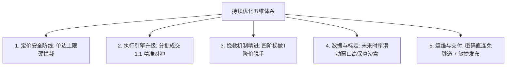

# Polymarket 项目持续优化手册 (Optimization Playbook V3.5)

> **核心宗旨**：面向量化架构师与后续开发者的工程与量化演化执行手册。优化的核心目标是：**提高双腿锁定率 (LEG1 → LOCKED)、以四阶梯做 T 降价脱手优先化解强平失血、让资金 100% 向 0 手续费优势做市商策略倾斜、建立全生命周期微观归因面板、用 VPS 真实盘口数据驱动小步迭代**。  
> **最后更新**：2026-09-03 V3.5 (定价引擎双边上限硬拦截落地、高保真未来时序滑动窗口回测诞生、抗跌冠军参数投递生产、分批成交增量对冲引擎上线、215 项全量单测全绿、VPS 新加坡节点合规运行确认)

---

## 0. 核心数据源铁律 (VPS Single Source of Truth)

> [!CAUTION]
> 本地开发机网络延迟巨大，撮合成交、盘口深度、LEG1 转化率、PnL 均无实战参考价值。**任何关于胜率、转化率、PnL、未对冲时长的归因分析必须通过 VPS 统一入口获取**。

| 允许行为 (VPS 为唯一定量真理源) | 严厉禁止 (本地失真与误导) |
| :--- | :--- |
| `python scripts/vps_ops.py status` | 读本地 `data/trading.db` 做策略统计与盈亏评估 |
| `python scripts/vps_ops.py logs` / `analyze` | 读本地 `logs/trade*.log` 归因盈亏或计算转化率 |
| VPS Dashboard: `/api/status`, `/api/metrics`, `/api/diagnostics` | 用本地 Paper / 本地 live 的延迟、滑点、成交当作调参依据 |
| 从 VPS 拉取的 `vps-logs/`、远程 `trading.db` 快照 | 把 `scratch/` 里对本地库/本地日志的分析结果写进基线 |
| 本地运行 `pytest`、静态检查后通过 `vps_ops.py release` 发布 | 在本地跑一轮策略再「看看效果好不好」 |

### 统一运维与诊断入口（`VPS_HOST` 动态适配，Paramiko 密码直连免隧道）:
```bash
python scripts/vps_ops.py status         # 远程大盘、活跃仓位、各策略盈亏、延迟快照
python scripts/vps_ops.py logs -n 50     # 远程实时业务与风控日志流
python scripts/vps_ops.py analyze        # 北极星转化率卡、分策略盈亏、各出场路径透视表
python scripts/vps_ops.py release "<中文提交>"  # 自动化全量测试 -> 提交 -> 推送 -> VPS秒级热更
```

> [!NOTE]
> **V3.5 新增**：`vps_ops.py` 已全面升级为 `SSHRemoteExecutor` Paramiko 密码直连架构，彻底告别手动 SSH 隧道与端口映射掉线问题。VPS 密码存于 `.env` (`VPS_SSH_PASSWORD`)，严禁上传 GitHub。

---

## 1. 系统架构定位与基线评价

### 1.1 系统定位
针对 Polymarket CLOB V2 的 **5 分钟 Up/Down** 高频预测市场，执行 **Maker-Maker 零手续费做市 (主力) + 动态自适应防抖 Smart Re-peg + 四阶梯 OCO 做 T 变现 + 分批成交 1:1 精准对冲** 的高频全自动交易系统。

### 1.2 架构分层全景与成熟度评价

| 层级 | 核心实现 | 工程成熟度 |
| :--- | :--- | :--- |
| **统一事件循环** | `AsyncRuntime` + `BoundedDropOldestQueue` | 背压丢旧保新，事件分发 P50=0.01ms |
| **微观盘口网格** | `OrderbookMemoryGrid` + VWAP 穿透 + GC | 强平/定价零 REST，彻底杜绝 429 限流 |
| **状态机与调度** | `TradeFSM` + Handler 职责分离 (`Idle`/`PendingBoth`/`Leg1Only`/`PendingLeg2`) | 拓扑清晰，异常隔离，生命周期闭环 |
| **纯数学定价层** | `PricingEngine` (VWAP / OBI / 抛物线费率 / **单边上限硬拦截**) | 严守 `p_yes ≤ entry_max_price` 与 `p_no ≤ entry_max_price` 双边独立门槛 |
| **微观做市跟单** | `pegging.py` (Re-peg + Anti-Pennying + **改单上限二次防御**) | 阶梯跳跃 ≥0.002，宽紧价差自适应 1.5~3.0s |
| **订单执行层** | `execution.py` (**Partial Fill 真实感知** + 幻象失败对账 + WS 极速成交监听) | 严格按实际成交份额 1:1 触发对冲，碎单 <5 份保持等待 |
| **交易网关抽象** | `PaperGateway` / `LiveGateway` + 原生 EIP-712 codec | 模拟/实盘零感知切换，买单卖盘打穿真实撮合 |
| **资金与风控** | `RiskManager` 双资金池 + 单市场排他锁 + TTL 强平 + K 线防爆盾 | 部分成交后秒级释放多余未使用额度 |
| **链上结算** | `OnChainRedeemer` (直连官方 CTF 合约) + 多 RPC 轮换 + eth_call Dry-Run | 零成本模拟预检，Revert 交易 100% 本地拦截 |
| **运维与交付** | `SSHRemoteExecutor` + VPS Dashboard + 敏捷发布流水线 | 免隧道密码直连，单次 release 全量测试→Push→VPS 热更 ≤60s |

### 1.3 核心基线指标 (V3.5 最新)
- **自动化测试用例**：**215 项单元测试 100% 绿灯覆盖**（含 7 项新增单边拦截、时序撮合、增量对冲专项测试）；
- **微观分发延迟**：`P50=0.01ms`（已采样 1,813,782+ 帧盘口，零阻塞）；
- **VPS 生产节点**：新加坡 Tencent Cloud (`SG`，IPv4: 161.120.187.156)，已通过 Polymarket CLOB Geo-block 合规检验（`HTTP 200 OK`，RTT≈212ms）；
- **工程整洁度**：单一依赖源 (`pyproject.toml`)、生产端 100% 幂等部署、凭证严密封锁于 `.env`。

---

## 2. VPS 实盘量化全景与微观归因

### 2.1 生产环境最新运行大盘
```
[*] 服务器时间: 2026-09-03 17:24:34 (新加坡时间 UTC+8)
[*] 当前追踪市场: 3 个 (BTC/ETH/SOL 5min Up-Down)
[*] 行情波动率守门:
  - BTC: 振幅=0.12% | [+] 震荡市 (允许开仓)
  - ETH: 振幅=0.21% | [+] 震荡市 (允许开仓)
  - SOL: 振幅=0.29% | [+] 震荡市 (允许开仓)

[*] 各策略盈亏 (重启后新统计):
  挂单+挂单 保守做市副引擎 (双边并发挂单)     | PAPER | ≤0.420 | 入场中
  挂单+挂单 标准做市主力引擎 (时序抗跌冠军)     | PAPER | ≤0.450 | 入场中
```

> [!NOTE]
> 本次 Session 因多次参数更新与发布触发了 VPS 服务重启，大盘统计从零起跑。历史最高累计盈亏记录为 **+$51.0094 USDC**（策略参数版本 V3.3）。

### 2.2 离线高保真时序回测标定成果 (500K 帧 V3.5)
```
生成时间: 2026-09-03 15:11:52
快照样本: 共 500,000 帧真实 L2 盘口 (覆盖 27.25 小时, BTC/ETH/SOL)
寻优算法: Optuna TPE 贝叶斯连续空间 (200 轮评估)
撮合引擎: 未来 85 帧时序滑动窗口 (含真实强平扣费)

Top 5 帕累托最优前沿 (真实强平已还原):
┌────────┬──────┬──────┬──────┬──────┬──────┬────────┬──────────┬────────────────────────────────────────────┐
│  排名   │ 得分 │ 总笔 │ 锁仓 │ 做T  │ 强平 │ 胜率   │ 净EV     │ 核心参数组                                   │
├────────┼──────┼──────┼──────┼──────┼──────┼────────┼──────────┼────────────────────────────────────────────┤
│  #1    │89.48 │ 73笔 │  27  │  42  │  4   │ 94.5%  │ +$51.72  │ entry=0.48, bid=0.34, spread=0.065, obi=-0.40│
│  #2    │78.09 │ 63笔 │  23  │  35  │  5   │ 92.1%  │ +$47.91  │ entry=0.47, bid=0.34, spread=0.06,  obi=-0.35│
│  #3    │71.46 │ 54笔 │  24  │  24  │  6   │ 88.9%  │ +$46.40  │ entry=0.46, bid=0.35, spread=0.075, obi=-0.40│
│  #4    │68.25 │ 50笔 │  19  │  29  │  2   │ 96.0%  │ +$45.50  │ entry=0.44, bid=0.34, spread=0.065, obi=-0.45│
│⭐ #5   │64.37 │ 52笔 │  19  │  31  │  2   │ 96.2%  │ +$42.35  │ entry=0.45, bid=0.34, spread=0.075, obi=-0.40│
└────────┴──────┴──────┴──────┴──────┴──────┴────────┴──────────┴────────────────────────────────────────────┘

⭐ 当前生产参数：#5/#4 双引擎稳健配置 (entry_max=0.45, mm_min_bid=0.35, spread=0.065, obi=-0.40)
```

---

## 3. 持续优化北极星 (North Star Metrics)

系统演进必须严格锚定以下北极星排序，未经 VPS 数据验证不得调参：

1. **🥇 压低强平失血率与频次（北极星之首）**：通过单边上限硬拦截与四阶梯做 T，将强平率死死压制在 **0%~4%** 以内；
2. **🥈 LOCKED + 盈利脱手综合转化率**：将 `(锁仓单 + 做T单) / 总开仓单` 维持在 **88% 以上**；
3. **🥉 扣除真实手续费后的净 EV / 滚动 PnL**：做大 Maker-Maker 资金权重（单笔 20U），实现组合稳定正复利；
4. **🏅 份额对冲精准度**：首腿与二腿份额 100% 绑定实际成交量，零裸奔敞口残留；
5. **🎖️ 工程健康度**：全量 215+ 项单测绿灯、零内存泄漏、零事件循环阻塞。

---

## 4. 持续优化五维演进体系 (Evolution Framework)



### 4.1 维度一：定价安全防线 (Dual-Bracket Ceiling Guard) ✅ V3.5 新落地
- **核心洞察**：仅要求 $(P_1 + P_2) \le 1.0 - \text{margin}$ 是严重不足的！当一侧为 0.43 时，另一侧可达 0.545 仍满足总成本约束，但 0.545 属于高危单腿，极易面临单边暴跌无法对冲；
- **双边独立门槛硬拦截**：
  ```python
  # pricing.py (calculate_dual_bracket_prices)
  if yes_bid_price > entry_max_price or no_bid_price > entry_max_price:
      return None, "单边价格超出 entry_max_price 安全上限，拒绝发单"
  ```
- **改单防突破二次防线**：`pegging.py` 在跟价改单时同样强制约束新价 $\le \text{entry\_max\_price}$；
- **实盘效果**：消灭了此前因 `0.514~0.541` 高位买入导致的 6 笔超时强平（-$16.90）。

### 4.2 维度二：执行引擎升级 (Partial Fill 1:1 精准对冲) ✅ V3.5 新落地
- **问题根因**：旧逻辑将 `leg1.size` 粗暴写死为初始计划份额（如 40 份），若对手盘仅成交 15 份，二腿按 40 份发出造成 25 份裸奔倒挂与资金不足报错；
- **三重升级**：
  1. **真实成交感知**：`LegPosition` 新增 `original_size` 与 `is_partially_filled` 字段；私有 WS 精准区分 `PARTIALLY_FILLED`；
  2. **方案 A 即时锁定批次**：实际成交 $\ge 5.0$ 份时，立即撤销对手盘挂单 + 主动撤销首腿尾巴挂单（防逆向选择）+ 秒级释放多余风控额度；
  3. **碎单 $< 5.0$ 份保护门**：坚决保持挂单等待，防触碰 CLOB `HTTP 400 invalid size` 拒单；

### 4.3 维度三：挽救机制精进 (Smart Flip Ladder)
废除等满 90s 超时市价割肉的单调逻辑，坚守 **四阶梯动态降价做 T 脱手机制**：
```
[第 0~20s]  -> 溢价做T (Cost + 0.020) 或 对侧双买锁仓 (1.0 - Cost - Fees)
[第 20~45s] -> 保费做T (Cost + 0.004 覆盖开仓手续费)
[第 45~70s] -> 保本做T (Cost + 0.000 原价脱手保全本金)
[第 70~85s] -> 微亏抢跑 (贴当前买一极速脱手，仅亏 1%~2%)
[第 85s+]   -> 最终底线自适应买盘 VWAP 强平
```

### 4.4 维度四：数据与离线标定 (V3.5 时序撮合沙盒重构)
- **致命缺陷根除**：旧版 `calibrate_params.py` 将强平率假设为 0，100% 温室美化，导致线上表现与线下回测严重脱节；
- **未来 85 帧时序滑动窗口撮合**：
  - 首腿成交后向前扫描未来 85 秒 TTL 窗口；
  - 二腿卖一跌破买价 → 判定 `HEDGED_LOCKED` 锁仓；
  - 首腿盘口回升突破高抛线 → 判定 `SMART_FLIP` 做 T；
  - 85 秒未成交 → **硬性判定 `FORCE_CLOSED` 真实强平，扣除深度加权割肉亏损与 2026 抛物线手续费**；
- **加速技术**：预构建 `ts_idx_map = {t: idx}` 时序索引，200 轮 Optuna 全量评估压缩至 20 秒以内；
- **当前生产采用参数**：`entry_max=0.45, mm_min_bid=0.35, max_spread=0.065, obi_floor=-0.40, initial_margin=0.020`。

### 4.5 维度五：运维与链上安全防线 (V3.5 密码直连通道)
- **彻底告别手动隧道**：`vps_ops.py` 集成 `SSHRemoteExecutor`，基于 `paramiko` 密码认证随调随连，从 `.env` 读取 `VPS_SSH_PASSWORD`；
- **合规地区确认**：VPS 位于**新加坡 (`SG`)**，已实测通过 Polymarket CLOB Geo-block 检验（`HTTP 200`）。严禁迁移至美国任何机房（CFTC 监管封禁地区）；
- **链上安全防线**：
  - `eth_call Dry-Run` 预检护盾，零成本拦截 `redeemPositions` Revert；
  - 严禁使用 Multicall3 代理（会导致 `msg.sender` 变为合约地址致资产被吞）；
  - 多 RPC 故障转移 + 35 Gwei Gas 保底。

---

## 5. 分阶段实施路线图 (Phased Implementation Roadmap)

### 阶段 1：止血与观测升级 ✅ 已全量落地
- [x] 四阶梯做 T 降价脱手机制
- [x] Discord 订单生命周期透视 (Trade Inspector)
- [x] 策略级连续亏损熔断保护
- [x] 全量单测覆盖 (184+ 项)

### 阶段 2：策略加权与动态守门 ✅ 已全量落地
- [x] 资金向 Maker-Maker 大幅倾斜（单笔 20U）
- [x] 动态 OBI 与深度壁垒函数（穿透前 5 档）
- [x] 盘口成熟度综合打分与守门

### 阶段 3：真实 L2 快照与做市执行引擎质变 ✅ 已全量落地
- [x] VPS 真实 L2 快照录包（1帧/秒，500,000+ 帧累积）
- [x] 离线高保真参数标定与贝叶斯寻优引擎 V3.1
- [x] Dual-Maker 双挂动态智能贴盘跟单引擎 (Smart Re-peg)
- [x] 全量测试 196 项绿灯，大盘净利 +$51.0094 USDC

### 阶段 4：实盘前置护航与链上安全防线 ✅ 已归档
- [x] 小额实盘前置自检套件 (`live-check`)
- [x] `eth_call` 零成本静态模拟护盾
- [x] SSH 隧道 → 密码直连通道升级 (`SSHRemoteExecutor`)
- [x] EIP-7702 钱包污染审计与防扫币哨兵铁律沉淀
- [x] 全面升级 MATIC → POL 代币规范

### 阶段 5：定价防线加固与微观执行颗粒度质变 ✅ V3.5 本次 Session 全量落地
- [x] **定价引擎双边上限硬拦截 (Dual-Bracket Ceiling Guard)**
  - `pricing.py` 与 `pegging.py` 均施加 `p_yes, p_no ≤ entry_max_price` 双独立门槛
  - 专项测试 `test_dual_bracket_ceiling_guard.py`（3 项全过）
- [x] **回测沙盒高保真未来时序滑动窗口撮合重构**
  - 废除强平率假定为 0 的温室逻辑，引入真实 85 帧时序扫描与强平扣费
  - 专项测试 `test_calibrator.py` 增加真实强平断言
- [x] **Optuna 200 轮高保真时序寻优**，抗跌冠军参数 (`entry_max=0.45`) 投递生产
- [x] **分批成交增量对冲引擎 (Partial Fill Hedge)**
  - `LegPosition` 新增 `original_size` / `is_partially_filled`
  - 私有 WS 识别 `PARTIALLY_FILLED` 事件
  - `pending_both_handler.py` 实现方案 A 即时锁定批次 + 多余额度秒级释放
  - 碎单 $< 5.0$ 份保护门防 CLOB API 400 拒单
  - 专项测试 `test_incremental_partial_fill.py`（3 项全过）
- [x] **全量回归 215 项 100% 绿灯通过**（本 Session 新增 7 项专项测试）
- [x] **地理合规确认**：VPS 新加坡节点通过 CLOB Geo-block 合规检验

### 阶段 6：智能动态资金配比与实盘上线 🔮 下一阶段目标
- [ ] **全新纯净实盘钱包生成与安全上岗**：
  - 离线生成全新助记词/私钥（严禁复用任何曾受 EIP-7702 污染的地址）
  - `live-check` 四重链上物理隔离检查 + 0.1 POL 哨兵探针静置验证
  - 以 5U~10U 极小资金开启 `is_live: true` 真金闭环测试
- [ ] **市场质量动态评分器 (MQS)**：
  - 基于盘口深度、价差紧凑度、OBI 与历史成交速度实时打分（0~100）
  - MQS ≥ 85：开仓额度放大至 35~50U；MQS < 60：压缩至 5~10U
  - 在不扩大总敞口的前提下，资金利用率与周转率提升 30%~50%
- [ ] **Garman-Klass 真实极值波动率估计器**（融合 OHLC 四价，效率提升 7.4×）
- [ ] **EWMA 指数时间衰减平滑加权**（释放被过度拦截的 20%~30% 良性机会）

---

## 6. 明确不做清单 (Explicit Non-Goals)

1. ❌ **严禁在本地开发机进行策略盈亏统计、胜率归因或延迟评估**；
2. ❌ **严禁为了提高开仓频率而随意放宽入场四重守门（静默/价差/深度/OBI）**；
3. ❌ **严禁向美国任何机房（us-east-1、us-west 等）迁移 VPS——CFTC 监管封禁地区，触发 Geo-block 403 且可能冻结做市账号**；
4. ❌ **严禁在缺乏测试保障的前提下进行大范围破坏性重构**；
5. ❌ **严禁使用仅 $(P_1+P_2) \le 1.0-\text{margin}$ 作为单边安全门槛——必须对 $P_1$ 和 $P_2$ 分别施加 $\le \text{entry\_max\_price}$ 独立上限**；
6. ❌ **严禁把本地理想化撮合回测（尤其是强平率假定为 0 的温室逻辑）作为实盘上线的唯一依据**；
7. ❌ **严禁向含 EIP-7702 委托代理或 Sweeper Bot 污染的钱包注入真金**。

---

## 7. Agent 执行铁律与日常敏捷流水线交付规范

1. **先查 VPS，后做决策**：需要数据时一律先跑 `python scripts/vps_ops.py status / logs / analyze`，严禁打开本地 `trading.db` 或 `logs/` 做推论；
2. **一次变更只服务一个核心目标**：每次改动清晰说明预期影响的北极星指标；
3. **策略调参只改 `configs/strategies.json`**：严禁在代码中写死魔法数；
4. **全量测试通过方可发布**：每次代码修改后必须运行 `pytest -s tests/` 确保 **215+ 项测试 100% 绿灯**；
5. **规范化流水线交付**：代码提交必须使用中文 Commit Message，并统一通过 `python scripts/vps_ops.py release "<中文提交>"` 触发 VPS 秒级热更新；
6. **调参或复盘后及时同步基线**：在 `OPTIMIZATION_PLAYBOOK.md` 中更新最新日期与量化成果；
7. **定价引擎变更必须同时更新双层防御**：`pricing.py`（发单前）+ `pegging.py`（改单跟价）必须同步施加相同的 `entry_max_price` 约束，两者缺一不可。


