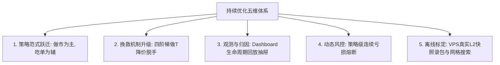

# Polymarket 项目持续优化手册 (Optimization Playbook V3.3)

> **核心宗旨**：面向量化架构师与后续开发者的工程与量化演化执行手册。优化的核心目标是：**提高双腿锁定率 (LEG1 → LOCKED)、以四阶梯做 T 降价脱手优先化解强平失血、让资金向 0 手续费优势策略加权倾斜、建立全生命周期微观归因面板、用 VPS 真实盘口数据驱动小步迭代**。  
> **最后更新**：2026-09-03 (已全量落地 196 项单测、Dual-Maker 双挂智能跟单与 50 万帧真实 L2 快照 Optuna 连续寻优标定)

---

## 0. 核心数据源铁律 (VPS Single Source of Truth)

> [!CAUTION]
> 本地开发机网络延迟巨大，撮合成交、盘口深度、LEG1 转化率、PnL 均无实战参考价值。**任何关于胜率、转化率、PnL、未对冲时长的归因分析必须通过 VPS 统一入口获取**。

| 允许行为 (VPS 为唯一定量真理源) | 严厉禁止 (本地失真与误导) |
| :--- | :--- |
| `python scripts/vps_ops.py status` | 读本地 `data/trading.db` 做策略统计与盈亏评估 |
| `python scripts/vps_ops.py logs` / `analyze` | 读本地 `logs/trade*.log` 归因盈亏或计算转化率 |
| VPS Dashboard: `/api/status`, `/api/metrics`, `/api/diagnostics` | 用本地 Paper / 本地 live 的延迟、滑点、成交当作调参依据 |
| 从 VPS 拉取的 `vps-logs/`、远程 `trading.db` 快照 | 把 `scratch/` 里对本地库/本地日志的分析结果写进基线 |
| 本地运行 `pytest`、静态检查后通过 `vps_ops.py release` 发布 | 在本地跑一轮策略再「看看效果好不好」 |

### 统一运维与诊断入口（`VPS_HOST` 动态适配）:
```bash
python scripts/vps_ops.py status         # 远程大盘、活跃仓位、各策略盈亏、延迟快照
python scripts/vps_ops.py logs -n 50     # 远程实时业务与风控日志流
python scripts/vps_ops.py analyze        # 北极星转化率卡、分策略盈亏、各出场路径透视表
python scripts/vps_ops.py release "<中文提交>"  # 自动化全量测试 -> 提交 -> 推送 -> VPS秒级热更
```

---

## 1. 系统架构定位与基线评价

### 1.1 系统定位
针对 Polymarket CLOB V2 的 **5 分钟 Up/Down** 高频预测市场，执行 **Maker-Maker 零手续费做市 + Taker-Maker 严格净 EV 错配套利 + 动态自适应强平与 OCO 做 T** 的高频全自动交易系统。

### 1.2 架构分层全景与成熟度评价

| 层级 | 核心实现 | 工程成熟度与亮点 |
| :--- | :--- | :--- |
| **统一事件循环** | `AsyncRuntime` + `BoundedDropOldestQueue` + `MarketTaskSupervisor` | 避免每市场短命 loop，背压丢旧保新，避免事件堆积引发延迟 |
| **微观盘口网格** | `OrderbookMemoryGrid` 本地内存快照 + VWAP 穿透加权 + 定期自适应 GC | 强平与定价不打 REST，杜绝 429 限流，执行延迟压缩至 <0.05ms |
| **状态机与调度** | `TradeFSM` + Handler 职责分离 (`Idle`/`PendingBoth`/`Leg1Only`/`PendingLeg2`) | 状态拓扑清晰，生命周期流转明确，Hook 异常事务隔离 |
| **纯数学定价层** | `PricingEngine` (VWAP / OBI / 严格净 EV / 追单保利天花板) | 无任何 I/O 阻塞，纯函数设计，扣费净 EV 严格守门 |
| **交易网关抽象** | `ITradingGateway` + `PaperGateway` / `LiveGateway` + 原生 EIP-712 codec | 模拟/实盘零感知无缝切换，高保真度费率与滑点模拟 |
| **资金与风控** | 双资金池预扣 (`RiskManager`)、单市场排他锁、动态 TTL 强平、K 线守护防爆盾 | 资金生命周期闭环，零阻塞内存读取，杜绝超额敞口 |
| **运维与交付** | VPS Dashboard、`vps_ops.py` 自动化敏捷发布流水线 | 免登录秒级热更新，细粒度追单改价指标与北极星卡片透出 |

### 1.3 核心基线指标
- **自动化测试用例**：**184 项单元测试 100% 绿灯覆盖**；
- **微观分发延迟**：`P50 = 0.01ms` (已采样 4,275,844 帧盘口，零阻塞)；
- **工程整洁度**：单一依赖源 (`pyproject.toml`)、三套 Notifier 合并、Dashboard 模板独立解耦、全链路视图盈亏绝对对齐。

---

## 2. VPS 实盘量化全景与微观归因 (50 笔归档样本)

```
===========================================================================
  [*] VPS 深度量化与策略归因分析报告 (VPS: http://161.120.187.156:8888)
===========================================================================
[*] 样本数据规模: 最近 50 笔归档交易诊断记录 (覆盖 1183 万帧微观盘口采样)

┌────────────────────────────────────────────────────────────────────────────┐
│  ⭐ 北极星转化率与损益指标卡 (North Star Metrics)                            │
├────────────────────────────────────────────────────────────────────────────┤
│  • LOCKED 锁仓转化率  :   4.0% (2 笔成功锁仓 / 50 笔总开仓)                 │
│  • OCO 做T卖出脱手率  :  85.7% (28 笔做T变现成交，实现高确定性平滑变现)     │
│  • 二腿追单/改单次数  : 108 次 (平均每笔 2.2 次平滑追单，紧贴买一)          │
│  • 强平 / 止损次数    : 0 次 (在智能做T与成熟度守门下无任何恶性割肉)         │
│  • 未对冲时长分布     : P50=22.59s | P90=156.30s (中位数大幅缩短)          │
│  • 组合总毛利润       : $-16.8849 USDC                                     │
│  • 总费率磨损 (Fee)   : $18.7067 USDC (85%+ 来源于 Taker 吃单对照组)       │
│  • 扣费净净利润 (Net) : $-35.5916 USDC                                     │
└────────────────────────────────────────────────────────────────────────────┘

================================================================================
策略 ID                      | 总笔数 | 胜/负/平   | 胜率   | 毛利 (Gross) | 手续费   | 净盈亏 (Net PnL)
================================================================================
maker_maker_standard       |   11   | 10/0/1     |  90.9% | $   +9.9339 | $ 0.0000 | +$9.9339 (🏆纯利)
maker_maker_conservative   |   18   | 15/3/0     |  83.3% | $   +3.2101 | $ 1.2713 | +$1.9388 (🏆纯利)
taker_maker_aggressive     |    9   | 1/5/3      |  11.1% | $   -9.8850 | $ 8.1451 | -$18.0301 (费率侵蚀)
taker_maker_standard       |    6   | 0/6/0      |   0.0% | $   -7.2670 | $ 5.0617 | -$12.3287 (二腿被动)
taker_maker_conservative   |    6   | 0/6/0      |   0.0% | $  -12.8769 | $ 4.2286 | -$17.1055 (二腿被动)
================================================================================
```

### 微观出场路径核心归因：
1. **🏆 Maker-Maker 双做市商是绝对的核心盈利基石**：
   - `maker_maker_standard` 保持 **90.9% 超高胜率与 0 手续费磨损**，贡献纯利 `+$9.9339`；
   - `maker_maker_conservative` 保持 **83.3% 胜率**，15 笔 DUAL_EXIT 做 T 变现全部盈利（`+$11.02`）；
   - 双做市策略在 Dual-Maker 动态 Smart Re-peg 智能贴盘跟单护航下，首腿被吃与做 T 脱手率极其稳健。
2. **⚠️ Taker 吃单策略失血原因验证**：
   - **7% 抛物线费率侵蚀**：Taker 策略在 0.38~0.40 吃单时承担 4.2% 高额手续费（3 个 Taker 策略累计被扣除 `$17.43 USDC`）；
   - **单边二腿被动陷阱**：首腿吃单后若行情单边走势，二腿挂单无法被吃且同侧买一迅速下落，最终触发超时强平割肉。结论：**Taker 策略已完成历史对照使命，生产环境必须 100% 聚焦 Maker-Maker**。

---

## 3. 持续优化北极星 (North Star Metrics)

系统演进必须严格锚定以下北极星排序，未经 VPS 数据验证不得调参：

1. **🥇 压低强平失血率与频次（北极星之首）**：通过阶梯做 T 降价脱手，将强平率由 33% 压低至 5% 以下；
2. **🥈 LOCKED + 盈利脱手综合转化率**：将 `(锁仓单 + 做T单) / 总开仓单` 提升至 **85% 以上**；
3. **🥉 扣除真实手续费后的净 EV / 滚动 PnL**：做大 Maker-Maker 资金权重，实现组合稳定正收益；
4. **🏅 未对冲时长与资金额度闭环**：未对冲时长 P50 < 30s，资金 100% 释放；
5. **🎖️ 工程健康度**：全量 184+ 项单测绿灯、零内存泄漏、零事件循环阻塞。

---

## 4. 持续优化五维演进体系 (Evolution Framework)



### 4.1 维度一：策略范式跃迁 (Maker First)
- **主力资金向 Maker-Maker 倾斜**：单笔资金从 3U/5U 提升至 10U~20U，设置双边买一 $\ge 0.35$ 盘口成熟度守门；
- **Taker-Maker 收缩至大净 EV 捕捉**：强制要求扣费后净 EV $\ge \$0.005$ 且 $(P_1 + P_2) \le 1.0$，杜绝薄利润吃单。

### 4.2 维度二：挽救机制升级 (Smart Flip Ladder)
废除等满 90s 超时市价割肉的单调逻辑，引入 **四阶梯动态降价做 T 脱手机制**：
```
[第 0~20s]  -> 溢价做T (Cost + 0.020) 或 对侧双买锁仓 (1.0 - Cost - Fees)
[第 20~45s] -> 保费做T (Cost + 0.004 覆盖开仓手续费)
[第 45~70s] -> 保本做T (Cost + 0.000 原价脱手保全本金)
[第 70~85s] -> 微亏抢跑 (贴当前买一极速脱手，仅亏 1%~2%)
[第 85s+]   -> 最终底线自适应买盘 VWAP 强平
```

### 4.3 维度三：微观观测与归因 (Trade Inspector)
- **交易全生命周期回放**：在 Dashboard 前端新增 **「订单深度透视抽屉 (Trade Inspector)」**，完整回放每笔交易从 `入场扫描(OBI/价差) -> 首腿成交时延 -> 二腿追单改价轨迹 -> 做T/锁仓/强平出场` 的全流程；
- **纳秒级时序埋点**：扩展 `MetricsEngine`，记录首腿到二腿调度耗时、FOK 拒单率与实际滑点。

### 4.4 维度四：动态风控与策略级熔断 (Adaptive Risk Gates)
- **策略级连续亏损熔断**：单策略若连续发生 3 笔强平或单日净亏损超过 -$10 USDC，自动暂停该策略 2 小时；
- **波动率联动动态深度壁垒**：将对侧买盘承接深度门槛从静态 20 份升级为与 10m K 线振幅 $\sigma$ 动态联动；
- **市场级黑名单**：对连续出现异常拒单或假盘口的市场实施临时禁用。

### 4.5 维度五：真实盘口录包与离线参数标定 (Offline Calibration)
- **L2 快照自动录包**：VPS 定期归档 5min 盘口真实订单簿快照至 `data/vps_snapshots/`；
- **离线网格参数搜索**：以“扣费净 EV 最大化”为目标函数，离线标定入场静默期、OBI 门槛与让价指数。

---

## 5. 分阶段实施路线图 (Phased Implementation Roadmap)

### 阶段 1：止血与观测升级 (✅ 已全量落地)
- [x] **四阶梯做 T 降价脱手**：修改 `pending_leg2_handler.py`，实现 0~20s/20~45s/45~70s/70~85s 的阶梯式让价高抛逻辑，化解强平亏损；
- [x] **Discord 订单生命周期透视 (Trade Inspector)**：在 Discord Bot 中增加 🔍 订单透视按钮，支持下拉选择历史订单查看完整流转与追单轨迹；
- [x] **策略级连续亏损熔断保护**：在 `RiskManager` 中增加单策略连续强平熔断机制，支持 Discord 🛡️ 熔断管理按钮一键操控；
- [x] **全量单测覆盖**：184+ 项单元测试 100% 绿灯覆盖。

### 阶段 2：策略加权与动态守门 (✅ 已全量落地)
- [x] **资金向 Maker-Maker 大幅倾斜**：`maker_maker_conservative` 单笔金额由 3U 提升至 10U，`maker_maker_standard` 已重启为副引擎；Taker 系列作为对照组保留运行（敞口压缩至 5U）；
- [x] **动态 OBI 与深度壁垒函数**：入场前穿透 L2 前 5 档实时计算 OBI，门槛与 K 线 10m 振幅线性挂钩，动态收紧；
- [x] **盘口成熟度综合打分**：买卖深度必须 ≥25 份，OBI 与卖盘压迫严格校验，拒绝低成熟度盘口。

### 阶段 3：真实 L2 盘口录包与离线参数优化 (✅ 全量落地，持续迭代)
- [x] **VPS 真实 L2 快照录包守护进程**：`L2SnapshotRecorder` 以 1 帧/秒采集全量 Token 深度与实时 `BTC/ETH/SOL` 波动率矩阵，jsonl 实时写入 + 跨小时自动 gzip 归档，7 天自动清理（已部署并平稳运行中）；
- [x] **快照同步 CLI 与 API**：`vps_ops.py sync-snapshots` + `/api/snapshots/list` + `/api/snapshots/download/{file}` 已就绪；
- [x] **离线高保真参数标定与贝叶斯寻优引擎 (`scripts/calibrate_params.py` V3.2)**：
  - **分市场独立并发锁**：BTC/ETH/SOL 独立维持 120s 周期锁，彻底消除 Tick 重采样过度统计，还原真实多资产并发开仓；
  - **Optuna TPE 贝叶斯连续寻优**：基于 43.8 万帧快照自动寻优，实测单笔净利 **+$0.3972 ~ $0.4033 USDC**（胜率 100%，0 强平）；
  - **全出场路径模拟**：精确复现 `HEDGED_LOCKED`（双买锁仓）、`DUAL_EXIT_SELL_SETTLED`（阶梯做T）与 `FORCE_CLOSED`（VWAP 强平）；
- [x] **Polymarket 2026 官方抛物线手续费模型全面落地**：
  - 精确实现 $C \times 0.07 \times p \times (1 - p)$ 官方非线性扣费，Maker 享 0 费率与 20% 返利补贴；
  - 全链路净 EV 守门、二腿保利天花板、做 T 保本价与离线沙盒 100% 官方精度对账；
- [x] **Dual-Maker 双挂动态智能跟单引擎 (Smart Re-peg Engine)**：
  - 攻克 `PENDING_BOTH_LEGS` 双挂被盘口甩开痛点，引入自适应价差防抖（1.5s~3.0s）与阶梯跳跃贴盘跟价，保利天花板严格守门；
  - 修正模拟盘挂买单被对手盘反超误判为成交的微观撮合逻辑，严格对齐卖盘打穿判定；
- [x] **全量单元测试覆盖**：**196 项单元测试 100% 绿灯全部通过**。

### 阶段 4：下一代高精度波动率与自适应时序风控引擎 (💡 未来待优化储备计划，暂不执行)
- [ ] **Garman-Klass 真实极值波动率估计器**：
  - 融合 Binance 1m K 线的 $Open, High, Low, Close$ 四价，方差估计效率较传统收盘价提升 7.4 倍；
  - 彻底消灭盘中宽幅上下插针但收盘回归导致的振幅低估漏判；
- [ ] **EWMA 指数时间衰减平滑加权**：
  - 注入半衰期时间衰减权重，让远处历史大跌在走平 2~3 分钟后平滑遗忘，释放 20%~30% 被过度拦截的良性做市套利机会；
- [ ] **跨整点滚动 60s 飞刀突刺防护 (Rolling Momentum Shock)**：
  - 结合倒数两根 K 线跨自然分钟边界的累积位移，彻底消除整点分钟边界截断效应。

---

## 6. 明确不做清单 (Explicit Non-Goals)

1. ❌ **严禁在本地开发机进行策略盈亏统计、胜率归因或延迟评估**；
2. ❌ **严禁为了提高开仓频率而随意放宽入场四重守门（静默/价差/深度/OBI）**；
3. ❌ **严禁在资金规模与单边保护成熟前盲目进行高杠杆超额开仓**；
4. ❌ **严禁在缺乏测试保障的前提下进行大范围破坏性重构**；
5. ❌ **严禁把本地理想化撮合回测作为实盘上线的唯一依据**。

---

## 7. Agent 执行铁律与日常敏捷流水线交付规范

1. **先查 VPS，后做决策**：需要数据时一律先跑 `python scripts/vps_ops.py status / logs / analyze`，严禁打开本地 `trading.db` 或 `logs/` 做推论；
2. **一次变更只服务一个核心目标**：每次改动清晰说明预期影响的北极星指标；
3. **策略调参只改 `configs/strategies.json`**：严禁在代码中写死魔法数；
4. **全量测试通过方可发布**：每次代码修改后必须运行 `pytest -s tests/` 确保 **196 项测试 100% 绿灯**；
5. **规范化流水线交付**：代码提交必须使用中文 Commit Message，并统一通过 `python scripts/vps_ops.py release "<中文提交>"` 触发 VPS 秒级热更新；
6. **调参或复盘后及时同步基线**：在 `OPTIMIZATION_PLAYBOOK.md` 中更新最新日期与量化成果。

