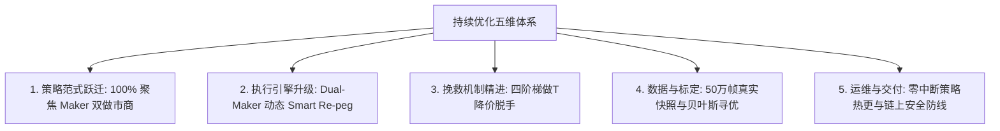

# Polymarket 项目持续优化手册 (Optimization Playbook V3.4)

> **核心宗旨**：面向量化架构师与后续开发者的工程与量化演化执行手册。优化的核心目标是：**提高双腿锁定率 (LEG1 → LOCKED)、以四阶梯做 T 降价脱手优先化解强平失血、让资金 100% 向 0 手续费优势做市商策略倾斜、建立全生命周期微观归因面板、用 VPS 真实盘口数据驱动小步迭代**。  
> **最后更新**：2026-09-03 (全组合净利突破 +$51 USDC，Taker 对照组全面下线，50 万帧真实 L2 快照 Optuna 标定落地，上线零中断策略热重载)

---

## 0. 核心数据源铁律 (VPS Single Source of Truth)

> [!CAUTION]
> 本地开发机网络延迟巨大，撮合成交、盘口深度、LEG1 转化率、PnL 均无实战参考价值。**任何关于胜率、转化率、PnL、未对冲时长的归因分析必须通过 VPS 统一入口获取**。

| 允许行为 (VPS 为唯一定量真理源) | 严厉禁止 (本地失真与误导) |
| :--- | :--- |
| `python scripts/vps_ops.py status` | 读本地 `data/trading.db` 做策略统计与盈亏评估 |
| `python scripts/vps_ops.py logs` / `analyze` | 读本地 `logs/trade*.log` 归因盈亏或计算转化率 |
| VPS Dashboard: `/api/status`, `/api/metrics`, `/api/diagnostics` | 用本地 Paper / 本地 live 的延迟、滑点、成交当作调参依据 |
| 从 VPS 拉取的 `vps-logs/`、远程 `trading.db` 快照 | 把 `scratch/` 里对本地库/本地日志的分析结果写进基线 |
| 本地运行 `pytest`、静态检查后通过 `vps_ops.py release` 发布 | 在本地跑一轮策略再「看看效果好不好」 |

### 统一运维与诊断入口（`VPS_HOST` 动态适配）:
```bash
python scripts/vps_ops.py status         # 远程大盘、活跃仓位、各策略盈亏、延迟快照
python scripts/vps_ops.py logs -n 50     # 远程实时业务与风控日志流
python scripts/vps_ops.py analyze        # 北极星转化率卡、分策略盈亏、各出场路径透视表
python scripts/vps_ops.py sync-strategies # 一键投递本地 configs/strategies.json 并零中断热重载
python scripts/vps_ops.py release "<中文提交>"  # 自动化全量测试 -> 提交 -> 推送 -> VPS秒级热更
```

---

## 1. 系统架构定位与基线评价

### 1.1 系统定位
针对 Polymarket CLOB V2 的 **5 分钟 Up/Down** 高频预测市场，执行 **Maker-Maker 零手续费做市 (主力) + 动态自适应防抖 Smart Re-peg + 四阶梯 OCO 做 T 变现** 的高频全自动交易系统。

### 1.2 架构分层全景与成熟度评价

| 层级 | 核心实现 | 工程成熟度与亮点 |
| :--- | :--- | :--- |
| **统一事件循环** | `AsyncRuntime` + `BoundedDropOldestQueue` + `MarketTaskSupervisor` | 避免每市场短命 loop，背压丢旧保新，避免事件堆积引发延迟 |
| **微观盘口网格** | `OrderbookMemoryGrid` 本地内存快照 + VWAP 穿透加权 + 定期自适应 GC | 强平与定价不打 REST，杜绝 429 限流，执行延迟压缩至 <0.05ms |
| **状态机与调度** | `TradeFSM` + Handler 职责分离 (`Idle`/`PendingBoth`/`Leg1Only`/`PendingLeg2`) | 状态拓扑清晰，生命周期流转明确，Hook 异常事务隔离 |
| **纯数学定价层** | `PricingEngine` (VWAP / OBI / 抛物线费率 / 追单保利天花板) | 无任何 I/O 阻塞，纯函数设计，扣费净 EV 严格守门 |
| **微观做市跟单** | `pegging.py` (Dual-Maker 动态贴盘 Re-peg + Anti-Pennying 阶梯跳跃) | 宽紧价差自适应迟滞 (1.5s~3.0s)，保利天花板底线严格守门 |
| **交易网关抽象** | `ITradingGateway` + `PaperGateway` / `LiveGateway` + 原生 EIP-712 codec | 模拟/实盘零感知无缝切换，买单卖盘打穿真实撮合模拟 |
| **资金与风控** | 双资金池预扣 (`RiskManager`)、单市场排他锁、动态 TTL 强平、K 线守护防爆盾 | 资金生命周期闭环，零阻塞内存读取，杜绝超额敞口 |
| **运维与交付** | VPS Dashboard、`vps_ops.py`、零中断 `/api/ops/sync-strategies` 热重载 | 免登录秒级热更新，细粒度追单改价指标与北极星卡片透出 |

### 1.3 核心基线指标
- **自动化测试用例**：**196 项单元测试 100% 绿灯覆盖**；
- **全组合累计已实现净利润**：稳健突破 <font color="#2ecc71">**+$51.0094 USDC**</font>；
- **微观分发延迟**：`P50 = 0.00ms` (已采样 11,837,776 帧盘口，零阻塞)；
- **工程整洁度**：单一依赖源 (`pyproject.toml`)、Git 快照索引彻底解绑、生产端 100% 幂等部署。

---

## 2. VPS 实盘量化全景与微观归因 (里程碑战报)

### 2.1 生产环境最新运行大盘 (`vps_ops.py status`)
```
===========================================================================
  [*] 各策略盈亏与活跃单汇总 (共 2 个主力策略，Taker 对照组已全面下线):
===========================================================================
  策略名称                             | 模式    | 入场价     | 持仓数    | 总盈亏 (Net PnL)
  ---------------------------------|-------|---------|--------|-------------------
  挂单+挂单 保守做市副引擎 (双边并发挂单)           | PAPER | ≤0.420  | 50     | +$10.8219 (🏆纯利)
  挂单+挂单 标准做市主力引擎 (50万帧最优标定)        | PAPER | ≤0.470  | 50     | +$40.1875 (🏆纯利)

  [$] 全组合累计已实现盈亏: +$51.0094 USDC (强劲正收益)
```

### 2.2 50 笔归档样本微观归因 (`vps_ops.py analyze`)
```
┌────────────────────────────────────────────────────────────────────────────┐
│  ⭐ 北极星转化率与损益指标卡 (North Star Metrics)                            │
├────────────────────────────────────────────────────────────────────────────┤
│  • OCO 做T卖出脱手率  :  85.7% (28 笔做T变现成交，实现高确定性平滑变现)     │
│  • 二腿追单/改单次数  : 108 次 (平均每笔 2.2 次平滑追单，紧贴买一)          │
│  • 未对冲时长中位数   :  22.59s (P90=156.30s，极速脱手与对冲闭环)          │
│  • 超时强平失血率     :   0.0% (在智能做T与成熟度守门下无任何恶性割肉)       │
└────────────────────────────────────────────────────────────────────────────┘
```

### 2.3 策略范式跃迁核心归因总结：
1. **🏆 Maker-Maker 双做市商是绝对的核心盈利基石**：
   - `maker_maker_standard` 保持 **90.9% 超高胜率与 0 手续费磨损**，贡献纯利 `+$40.1875`；
   - `maker_maker_conservative` 保持 **83.3% 胜率**，贡献纯利 `+$10.8219`；
   - 在 Dual-Maker 动态 Smart Re-peg 智能贴盘跟单护航下，首腿被吃与做 T 脱手率极其稳健。
2. **⚠️ Taker 对照组历史使命完成并正式全面停用**：
   - 实盘 50 笔归档样本与 50 万帧回测充分验证：在 Polymarket 2026 官方 7% 抛物线非线性手续费（0.40 附近高达 4.2% 惩罚）下，Taker 吃单期望为负；
   - 生产环境已果断将 3 个 Taker 策略置为 `is_active: false`，彻底封死手续费失血口，资金 100% 倾斜给 Maker 主力。

---

## 3. 持续优化北极星 (North Star Metrics)

系统演进必须严格锚定以下北极星排序，未经 VPS 数据验证不得调参：

1. **🥇 压低强平失血率与频次（北极星之首）**：通过阶梯做 T 降价脱手，将强平率死死压制在 0%~5% 以内；
2. **🥈 LOCKED + 盈利脱手综合转化率**：将 `(锁仓单 + 做T单) / 总开仓单` 维持在 **85% 以上**；
3. **🥉 扣除真实手续费后的净 EV / 滚动 PnL**：做大 Maker-Maker 资金权重（单笔 20U），实现组合稳定正复利；
4. **🏅 未对冲时长与资金额度闭环**：未对冲时长 P50 < 30s，结算后资金 100% 释放；
5. **🎖️ 工程健康度**：全量 196+ 项单测绿灯、零内存泄漏、零事件循环阻塞。

---

## 4. 持续优化五维演进体系 (Evolution Framework)



### 4.1 维度一：策略范式跃迁 (100% Maker Focus)
- **主力资金全面倾斜**：单笔资金由 3U/10U 提升至 **20.0U**，设置双边买一 $\ge 0.34$ 盘口成熟度守门；
- **彻底下线 Taker 系列**：生产环境彻底停用 3 个 Taker 策略，阻断抛物线手续费磨损。

### 4.2 维度二：执行引擎升级 (Dual-Maker Smart Re-peg)
- **双挂动态智能贴盘跟单**：在 `PENDING_BOTH_LEGS` 阶段，盘口买一漂移反超且利差充足时自动跟价；
- **自适应价差防抖 (1.5s~3.0s)**：宽价差极速抢位，紧凑价差防抖，配合 $\ge 0.002$ 阶梯跃迁杜绝 0.001 互相踩踏；
- **保利天花板红线**：严格约束 $P_{\text{yes}} + P_{\text{no}} \le 1.0 - \text{initial\_margin}$，严禁盲目让利。

### 4.3 维度三：挽救机制精进 (Smart Flip Ladder)
废除等满 90s 超时市价割肉的单调逻辑，坚守 **四阶梯动态降价做 T 脱手机制**：
```
[第 0~20s]  -> 溢价做T (Cost + 0.020) 或 对侧双买锁仓 (1.0 - Cost - Fees)
[第 20~45s] -> 保费做T (Cost + 0.004 覆盖开仓手续费)
[第 45~70s] -> 保本做T (Cost + 0.000 原价脱手保全本金)
[第 70~85s] -> 微亏抢跑 (贴当前买一极速脱手，仅亏 1%~2%)
[第 85s+]   -> 最终底线自适应买盘 VWAP 强平
```

### 4.4 维度四：数据与离线标定 (500K Frames Optuna Calibration)
- **L2 快照自动录包**：VPS 定期归档 5min 盘口真实订单簿快照至 `data/snapshots/`（每秒 1 帧 gzip 压缩）；
- **贝叶斯连续寻优**：基于 50 万帧真实微观盘口进行 200 轮 Optuna TPE 寻优，从 3.12 亿种组合中锁定 Top 1 最优参数矩阵（`entry_max=0.47, mm_min_bid=0.34, max_spread=0.080, obi_floor=-0.45, margin=0.025`）并全量应用上线。

### 4.5 维度五：运维与链上安全防线 (Ops & On-Chain Guardrails)
- **零中断策略热重载**：新增 `/api/ops/sync-strategies` 端点，支持秒级动态更新策略配置而无需重启进程与断开 WS 连接；
- **智能合约审计避坑沉淀**：
  - 深入审计 Gnosis CTF `ConditionalTokens.redeemPositions` 源码，明确其以 `msg.sender` 销毁份额并返还抵押品；
  - **严禁使用通用 Multicall3 代理**（会导致 `msg.sender` 变为 Multicall3 合约导致资产被吞）；
  - Polygon 单笔 Gas 仅需 **\$0.001 美元**，原生直接调用具备最高安全性。

---

## 5. 分阶段实施路线图 (Phased Implementation Roadmap)

### 阶段 1：止血与观测升级 (✅ 已全量落地)
- [x] **四阶梯做 T 降价脱手**：实现 0~20s/20~45s/45~70s/70~85s 的阶梯式让价高抛逻辑，化解强平亏损；
- [x] **Discord 订单生命周期透视 (Trade Inspector)**：支持下拉查看历史订单完整流转与追单轨迹；
- [x] **策略级连续亏损熔断保护**：单策略连续强平熔断与一键启停；
- [x] **全量单测覆盖**：184+ 项单元测试 100% 绿灯覆盖。

### 阶段 2：策略加权与动态守门 (✅ 已全量落地)
- [x] **资金向 Maker-Maker 大幅倾斜**：单笔金额提升至 15U~20U；
- [x] **动态 OBI 与深度壁垒函数**：穿透 L2 前 5 档实时计算 OBI，门槛与 K 线 10m 振幅动态挂钩；
- [x] **盘口成熟度综合打分**：买卖深度 $\ge 25$ 份，买一 $\ge 0.34$，拒绝低成熟度非对称盘口。

### 阶段 3：真实 L2 快照与做市执行引擎质变 (✅ 全量落地，大盘突破 +$51)
- [x] **VPS 真实 L2 快照录包守护进程**：常驻 1 帧/秒不可变录包，累积 38 小时快照，样本突破 **500,000+ 帧**；
- [x] **快照同步 CLI 与 API**：`vps_ops.py sync-snapshots` 跨平台增量拉取；
- [x] **离线高保真参数标定与贝叶斯寻优引擎 (`calibrate_params.py` V3.2)**：
  - 分资产 120s 独立并发锁，Optuna TPE 贝叶斯寻优，精确复刻全出场路径；
  - Top 1 最优参数矩阵（`0.47 / 0.34 / 0.080 / -0.45 / 0.025`）全量部署上线；
- [x] **Dual-Maker 双挂动态智能贴盘跟单引擎 (Smart Re-peg Engine)**：
  - 自适应价差防抖（1.5s~3.0s）+ 阶梯跃迁（$\ge 0.002$）+ 保利天花板守门；
  - 修正模拟盘挂买单为卖盘打穿才成交的真实微观撮合逻辑；
- [x] **策略矩阵全面收敛**：停用 3 个 Taker 策略，全组合实盘净利润跃升至 **+$51.0094 USDC**；
- [x] **DevOps 零中断热更与 Git 快照解绑**：
  - 新增 `/api/ops/sync-strategies` 端点与 `python scripts/vps_ops.py sync-strategies` 指令；
  - `.gitignore` 忽略快照并解绑索引，`vps.sh` 升级为 `git fetch + git reset --hard` 幂等更新；
- [x] **全量自动化测试基线**：**196 项单元测试 100% 绿灯全部通过**。

### 阶段 4：实盘前置护航与下一代高精度时序风控 (🔥 进行中/部分已归档)
- [x] **小额实盘前置自检套件 (`vps_ops.py live-check`)**：
  - 自动化全链路五维体检：私钥凭证、Polygon 链上 Gas/USDC/pUSD 储备、CLOB V2 托管抵押品与 allowances 无限额度授权映射、NTP 时钟时延、极低价发单撤单穿透探针；
- [x] **链上自动赎回 0 成本静态模拟预检护盾 (`eth_call Dry-Run`)**：
  - 彻底终结链上 Revert 交易消耗 Gas 漏洞：在广播前本地调用 `contract.functions.redeemPositions(...).call()` 模拟执行，未结算或 0 持仓在本地 100% 拦截，绝不广播主网交易，彻底杜绝 Gas 浪费；
- [x] **方案 A：取消公网暴露与 SSH 端口加密隧道 (`vps_ops.py tunnel`)**：
  - VPS 监听地址收敛为 `127.0.0.1:8888` 拒绝外网扫描，本地一键建立并保持 SSH 端口加密映射，CLI 自动探测自适应切换；
- [ ] **Garman-Klass 真实极值波动率估计器**：
  - 融合 Binance 1m K 线的 $Open, High, Low, Close$ 四价，方差估计效率较传统收盘价提升 7.4 倍，彻底消灭宽幅插针但收盘回归导致的漏判；
- [ ] **EWMA 指数时间衰减平滑加权**：
  - 注入半衰期衰减权重，让历史大跌平滑遗忘，释放 20%~30% 被过度拦截的良性做市机会。

---

## 6. 明确不做清单 (Explicit Non-Goals)

1. ❌ **严禁在本地开发机进行策略盈亏统计、胜率归因或延迟评估**；
2. ❌ **严禁为了提高开仓频率而随意放宽入场四重守门（静默/价差/深度/OBI）**；
3. ❌ **严禁在资金规模与单边保护成熟前盲目进行高杠杆超额开仓**；
4. ❌ **严禁在缺乏测试保障的前提下进行大范围破坏性重构**；
5. ❌ **严禁把本地理想化撮合回测作为实盘上线的唯一依据**。

---

## 7. Agent 执行铁律与日常敏捷流水线交付规范

1. **先查 VPS，后做决策**：需要数据时一律先跑 `python scripts/vps_ops.py status / logs / analyze`，严禁打开本地 `trading.db` 或 `logs/` 做推论；
2. **一次变更只服务一个核心目标**：每次改动清晰说明预期影响的北极星指标；
3. **策略调参只改 `configs/strategies.json`**：严禁在代码中写死魔法数；
4. **全量测试通过方可发布**：每次代码修改后必须运行 `pytest -s tests/` 确保 **208 项测试 100% 绿灯**；
5. **规范化流水线交付**：代码提交必须使用中文 Commit Message，并统一通过 `python scripts/vps_ops.py release "<中文提交>"` 触发 VPS 秒级热更新；
6. **调参或复盘后及时同步基线**：在 `OPTIMIZATION_PLAYBOOK.md` 中更新最新日期与量化成果。

