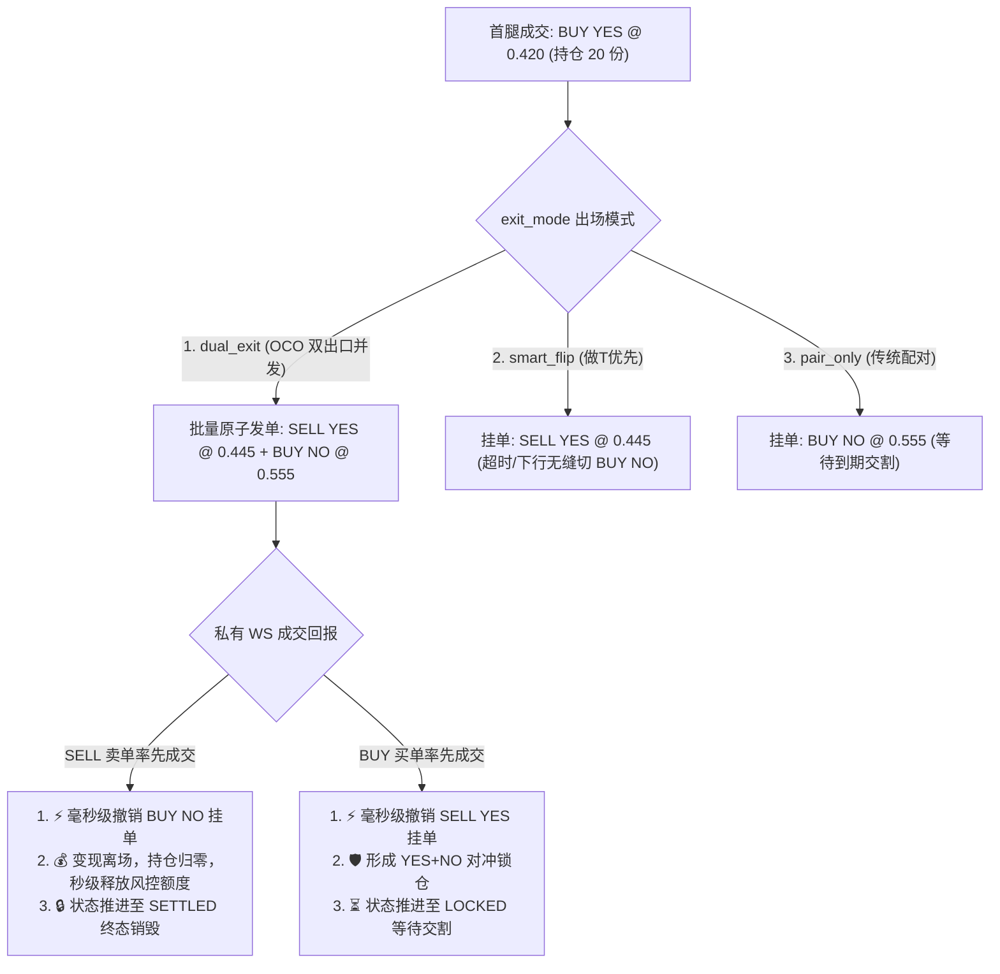
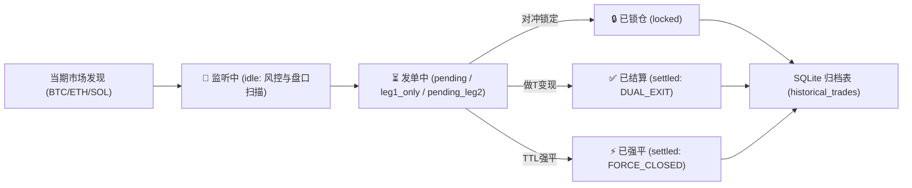

# Polymarket 策略逻辑与架构全景解析

## 1. 核心架构概述
该机器人是一个针对 Polymarket (CLOB V2) 短期高频市场（例如 5 分钟 BTC/ETH 市场）设计的**自动化量化对冲套利引擎**。由于 Python 架构在纳秒级纯吃单 (Taker-Taker) 争夺中处于劣势，系统的核心盈利模式被设定为 **Taker-Maker（吃一挂二）** 或 **Maker-Maker（双边挂单）**，通过承担极短暂的单边风险来赚取**流动性溢价 (Spread)**。

---

## 2. 市场发现与数据流 (Market Data Pipeline)
### 2.1 市场扫描
- 机器人通过后台线程 (`_loop_discover_markets`) 定期轮询 Polymarket 的 REST API。
- 当扫描到目标市场（通常是流动性较弱但利润空间厚的**长尾事件市场**）时，系统会为该市场并发实例化多套不同参数配置的 **策略状态机 (TradeFSM)**，例如 `aggressive`, `conservative`, `standard`。

### 2.2 WebSocket 订阅与分发 (`Streamer`)
- 为了极速响应盘口变化，所有 FSM 策略实例共享一个单例的 `MarketDataStreamer`。
- **防抖限流**：当多个策略同时注册新市场时，Streamer 会利用 `0.5` 秒防抖机制，将活跃资产 ID 打包成一个 Payload，防止触发官方的 `INVALID OPERATION` 限流。
- 采用 **Zero-Copy** 模式将数据流直接推送到各个 FSM 的 `Queue` 中。

---

## 3. 动态风控护栏 (Risk Management)
在真正进入交易逻辑前，所有价格数据必须经过严格的统计学风控过滤，防止在极端行情下入场被“埋”：

### 3.1 宏观与微观盘口拦截 (Risk Interceptors)
系统在进入实际下单逻辑前，设置了 7 道严格的风险拦截防线：
1. **买卖价差异常拦截 (Bid-Ask Spread)**：如果当前盘口的买卖价差（`best_ask - best_bid`）大于 `0.05`，说明市场正处于流动性真空或做市商撤单的剧震期。此时如果强制作为 Taker 吃单，将承受极大的隐性滑点，因此直接静默拦截首腿开仓。
2. **极端单边压迫 (OBI 防爆盾)**：利用 `kline_analyzer` 计算微观订单簿不平衡度 (Orderbook Imbalance)。当 OBI < -0.8 时（即深层买单极弱，卖单极强），主动拦截。这能有效防范大户利用撤销买单支撑位来制造“诱多陷阱”导致我们高位接盘。
3. **波动率异常拦截 (K 线防爆盾)**：维持一个滑动价格窗口，计算价格的均值与标准差。如果当前盘口最新变动振幅超过 **3 倍标准差** 且大于动态配置的最小阈值（如 `0.3%~0.45%`），即判定市场处于“单边剧烈波动 (Choppy Market)”，立刻熔断拦截入场，防止挂单被单边行情碾压。
4. **极度偏斜盘口与入场价超限**：
   - **防追高 (`entry_max_price`)**：入场价不得高于此值（如 `0.45`），保留足够的对冲利润空间。
   - **防黑天鹅 (`entry_min_price`)**：入场价不得低于此值（如 `0.05`）。极低价格（极度偏斜盘口）通常意味着极小概率事件。若此时入场，不仅资金利用率极低，而且如果发生黑天鹅事件，单边库存将面临 100% 的本金损失风险。
5. **并发单边敞口超限**：全局统计当前未对冲的单腿数量，若达到 `max_concurrent_unhedged_trades` 上限，直接拦截新的首腿开仓，防止在极端全盘行情下发生系统性的全仓位风险暴露。
6. **深度与 VWAP 穿透保护**：在正式下单前，必须提取 Orderbook 深网，模拟使用目标资金量（如 10 USDC）去扫盘计算加权平均价 (VWAP)。如果算上最大滑点容忍度后，发现盘口深度不足以吃下订单，拒绝入场（防止部分成交产生“碎股”）。
7. **临期交割拦截**：为了防止首腿入场后因距离市场结束太近而无法挂出二腿，在距离到期前 **45 秒内**，禁止任何新仓位开启，彻底封死因交割锁定而导致的被迫单边持仓。

---

## 4. 核心交易引擎 (FSM 状态机流转)
每个市场的套利由 `strategy_fsm.py` 驱动，分为六个核心状态：

### 📈 状态 1: `IDLE` (机会计算与入场分流)
- **模式 A：双腿并发限价挂单 (Dual-GTC Bracket Maker)**：
  - 专用于 `maker_maker` 策略。在满足震荡条件时，通过 `/batch-orders` 接口**原子级同时挂出 YES 与 NO 双边买单**。
  - 定价基于互补锁定方程：$\text{YES}_{\text{bid}} = \text{买一} + 0.001$，$\text{NO}_{\text{bid}} = 1.0 - \text{YES}_{\text{bid}} - 1.5\%$。两腿组合成本锁定在 $0.985$，**免除手续费并锁定 1.5% 确定性收益**。
  - 提交后直接跃迁至 `PENDING_BOTH_LEGS`。
- **模式 B：单腿切入 (Taker-Maker / Taker-Taker)**：
  - 针对流动性较好的一端，以最优卖价（`best_ask <= entry_max_price`）作为首腿 FOK 吃单目标，提交后跃迁至 `PENDING_LEG1`。

### 🚀 状态 2: `PENDING_BOTH_LEGS` (双边并发挂单做市)
- 系统在 WS 事件循环与轮询中持续跟踪双边挂单状态：
  - **双边同时成交**：直接进入 `LOCKED`，达成**零单边暴露完美套利**。
  - **单边先被吃单**：将已成交侧标记为 `leg1`，未成交侧标记为 `leg2`，进入 `LEG1_ONLY` 并立即启动 **90s 动态 TTL 倒计时**。
  - **临期未成交**：剩余时间 $<30s$ 且双边均未被吃时，调用批量撤单，安全退出回到 `IDLE/FAILED`。

### 💸 状态 3: `PENDING_LEG1` (首腿吃单 / Taker)
- 向目标资产发送 `FOK (Fill-or-Kill)` 订单。
- **自适应重试 (`_adaptive_post_order`)**：如果由于微小滑点导致 FOK 被拒，引擎会自动在 `max_slippage` 安全范围内微调价格进行多次重试。
- **幻象失败防御**：若接口返回 HTTP 异常但包含撮合层 `orderID`，标记为 `UNCONFIRMED` 态，并由 Data API 链上对账确认真实成交，绝不轻信网络断连。
- 确认成交后获取真实成交份数（Shares），转入 `LEG1_ONLY`。

### 🛡️ 状态 4: `LEG1_ONLY` (单边库存暴露与 90s TTL 倒计时)
- **绝对规模对齐 (Shares Alignment)**：读取首腿实际成交持仓份数，将二腿下单数量严格对齐首腿已持仓份数。
- 转入 `Maker` 身份，在另一端挂出 `GTC` 订单等待被吃，从而完成对冲锁润，状态转入 `PENDING_LEG2`。
- **单边异常保护**：若 WS 监听循环遭遇偶发网络异常，**严禁将持仓设为 FAILED**，必须保留状态交由守护线程兜底强平。

### ⚔️ 状态 5: `PENDING_LEG2` (深度反卷与智能挂单)
二腿挂出后，为了防止被人用 $0.001 的微弱差价压制导致无法成交，引擎启动了 **Anti-Pennying** 智能挂单博弈：
- **迟滞防抖**：一旦发现被别人压单，不立即撤单重挂，而是随机装死 `1.5~3.5s` 过滤假动作。
- **阶梯式跃迁**：若对手仍在，直接以 `0.002~0.004` 的跨度抢回盘口买一，直至触及动态安全底线 `dynamic_reentry_max`。
- 若二腿成功被吃，转入 `LOCKED`。

### ⏱️ 状态 6: `TTL 超时强平守护` (Stop-Loss Daemon)
- **后台死神守护线程 (`_fsm_timeout_daemon`)** 全局巡视处于 `LEG1_ONLY` 或二腿一直挂单未成交的市场。
- **单调递减 TTL**：基础容忍时长 `LEG1_MAX_UNHEDGED_SECONDS = 90s`（高波联动线性收紧至 `35s`，临期截断至 `15s`）。
- **强平成交双重兜底**：一旦超时，引擎先撤销二腿挂单，随后发送 `FOK @ 0.99` 强制市价止损。若 FOK 快速确认未成交或首发异常，立即自动以 `GTC @ 0.99` 紧急挂单兜底，**彻底杜绝单边遗弃与裸奔归零**。

---

## 5. 高保真仿真与结算 (Simulation & Redeeming)
### 5.1 模拟盘仿真 (Paper Trading)
- 引入了 `SIM_BASE_FILL_RATE` 模拟极速下单时的真实拒绝率（滑点被抢）。
- 引入 `SIM_LATENCY` 延迟与滑点，保证模拟收益不虚高。

### 5.2 自动结算赎回
- 实盘模式下，全局 `StrategyManager` 中的守护线程 `_loop_redeem_closed_markets` 会自动轮询已结束（Settled）的市场。
- 调用官方 `post_redeem()` 接口，将对冲好的 1:1 `YES + NO` 凭证强制合并，向 Polygon 链请求结算 `1 USDC` 到钱包，实现盈利闭环。

---

## 6. 实盘底层与 CLOB V2 签名架构 (Live Execution & Signing)

Polymarket CLOB V2 (升级后) 对实盘下单采用**双层认证协议 (Dual-Layer Auth)**：

```
┌──────────────────────────────────────────────────────────┐
│                   PolyClient 混合架构                     │
├──────────────────────────┬───────────────────────────────┤
│    离线密码学签名引擎     │        高可靠网络传输层       │
│  (PyClobSigner - Local)  │     (requests.Session + Pool) │
├──────────────────────────┼───────────────────────────────┤
│ • EIP-712 Order Hashing  │ • truststore 系统证书注入     │
│ • salt 生成与精度转换    │ • HTTP/HTTPS 代理智能路由     │
│ • 0 额外网络往返 (0ms)   │ • 指数退避重试 (Retry策略)    │
│ • 支持 EOA/Proxy 多类型  │ • L2 HMAC-SHA256 请求头计算   │
└──────────────────────────┴───────────────────────────────┘
```

### 6.1 双层认证分工
1. **L1 订单签名 (EIP-712)**：
   - 智能合约层面的合法性验证。每个订单必须由下单私钥在本地进行 EIP-712 签名，生成包含 `salt`, `maker`, `signer`, `makerAmount`, `takerAmount`, `signature` 的完整数据结构。
   - **支持多种钱包签名类型 (`SIGNATURE_TYPE`)**：
     - `0`: 标准 EOA 钱包（MetaMask 私钥等）。
     - `1`: Polymarket Proxy 代理合约。
     - `2`: Gnosis Safe 多签/托管钱包。
2. **L2 HMAC-SHA256 鉴权**：
   - REST 网关层面的身份验证。通过 `POLY_API_KEY`, `POLY_PASSPHRASE`, `POLY_TIMESTAMP`, `POLY_SIGNATURE`, `POLY_ADDRESS` 五件套对每次 HTTP 请求进行哈希签名验证。

### 6.2 离线签名与零网络开销 (Zero-Network Signing)
- 在调用签名构建器时，显式指定 `tick_size="0.01", neg_risk=False`，彻底规避 SDK 私自调用远程 REST API 探测 Orderbook 带来的 200ms~500ms 额外延迟。
- 签名计算完全在本地内存完成（实测仅需 0.45ms），保障了高频首腿吃单与二腿反卷的极致毫秒级响应。

---

## 7. 实盘高可用与资金安全防御体系 (Resilience & Safety)

### 7.1 幻象失败防御 (Phantom-Fill Guard)
在跨国跨境网络高时延场景下，即使 HTTP POST 报出 400（FOK killed）或 401 鉴权超时，订单可能已经到达撮合引擎并撮合成交。
- **OrderID 深度捕获**：底层客户端在捕获任何 HTTP 异常时，强制解析响应体中的 `orderID`，返回 `UNCONFIRMED` 安全态而非盲目返回 `None`。
- **免签名 Data API 终极对账**：当 CLOB REST 轮询超时（>15s）时，自动触发向公共 Data API (`/trades?user=`) 查询链上真实成交。只要检测到链上成交记录，立即判定成功并推进至二腿对冲，**彻底消灭因网络报错误判丢失单边持仓的“幻象失败”**。

### 7.2 风控额度生命周期闭环
- **双向全量清锁 (`release_market_lock`)**：无论交易正常结算（SETTLED）、止损退出（FAILED）还是成功锁仓（LOCKED），无条件显式清空该市场所占用的所有预扣保证金。
- **事件驱动链上余额自适应**：在市场 Redeem 结算后及 PnL 更新时，动态刷新真实抵押品余额并重设 `max_exposure`，确保小资金账户随时具备充足可用额度。

---

## 9. 双资金池风控与资金管理 (Dual-Pool Capital Management)

系统实现了 **实盘与模拟盘双资金池物理隔离 (Dual-Pool Isolation)**：

```
┌───────────────────────────────────────────────────────────┐
│                 RiskManager (单例风控中心)                 │
├─────────────────────────────┬─────────────────────────────┤
│   模拟盘资金池 (Paper Pool)  │   实盘资金池 (Live Pool)    │
├─────────────────────────────┼─────────────────────────────┤
│ • 默认资金: $100.00 USDC     │ • 链上实时 USDC 抵押品余额  │
│ • 独立 paper_used_exposure  │ • 95% 安全敞口缓冲          │
│ • 独立模拟锁仓与释放        │ • 独立 live_used_exposure   │
└─────────────────────────────┴─────────────────────────────┘
```

- **杜绝小额锁死**：实盘极小额测试账户（如 0.14U）不会阻碍模拟盘策略（100U）对多市场的并发演练。
- **动态释放与链上同步**：交易在进入 `LOCKED`、`SETTLED`、`FAILED` 或自动 `Redeem` 领奖后，无条件全生命周期释放风控额度并从链上刷新真实余额。

---

## 10. 私有 WebSocket 用户订单流 (User Order Stream)

为彻底消灭首腿成交后二腿对冲的 REST 轮询等待与 503 限流风险，系统新增了 **`UserOrderStreamer`** 单例：

- **端点协议**：直连 `wss://ws-subscriptions-clob.polymarket.com/ws/user`，长连接自动发送 L2 API 鉴权帧与心跳保活。
- **⚡ <5ms 极速对冲**：首腿在撮合引擎内撮合成交的瞬间，WS 主动推送 `FILLED` 事件，毫秒级唤醒协程推进至 `LEG1_ONLY` 并下发二腿挂单，将单边敞口暴露期压缩至极限。
- **终极双保险**：若私有 WS 遭遇网络偶发抖动，自动平滑降级至免签公共 Data API 链上对账防线。

---

## 11. 平仓与到期交割结算价格闭环 (Settlement & Realized PnL)

系统建立了完整的 **平仓与交割真实盈亏核算体系**，彻底终结了此前强平显示 `EV: $0.0000` 造成的账本失真：

```mermaid
graph TD
    A[单边持仓触发自适应强平] --> B[撤销二腿未成交挂单]
    B --> C[穿透订单簿买盘深度计算 Bid VWAP 均价]
    C --> D[发送市价 FOK 平仓单]
    
    D -->|✅ 平仓成功| E["生成平仓卖出明细: LegPosition(side='SELL', cost=VWAP)"]
    E --> F["核算 Realized PnL = (close_price - leg1_cost) * size - fees"]
    
    D -->|❌ 平仓失败/临期锁定| G[自动捕获到期最终结算价 settlement_price (1.0 或 0.0)]
    G --> H["核算 Settled PnL = (settlement_price - leg1_cost) * size - entry_fee"]
    
    F --> I[更新 ctx.leg2 为 SELL 明细，精准归档入库与看板]
    H --> I
```

1. **市价平仓成功 (`FORCE_CLOSED`)**：
   - 自动拉取买单深度计算 **Bid VWAP 深度加权均价**；
   - 核算扣除双边手续费后的真实 `Realized PnL`；
   - 将 `ctx.leg2` 明确记录为 **`SELL YES @ close_price`** 卖单明细，消除误导性 `BUY` 挂单残留。
2. **二腿平仓失败直至到期 (`EXPIRY_RESOLVED`)**：
   - 自动捕获市场最终裁决结算价 `settlement_price`（胜者 1.0 / 败者 0.0）；
   - 计算终态交割损益（免卖出手续费）并持久化到 SQLite 历史账本。

---

## 12. 领域驱动分层与代码解耦设计 (Software Architecture & Layering)

系统采用了轻量级 **DDD-Lite / Service Pattern** 分层设计，消除上帝类 (God Class)，实现 100% 内存级单测与强类型约束：

```
src/polymarket/
├── domain/                     # 1. 领域模型层 (Domain Entities & State)
│   ├── models.py               # 强类型 TradeContext (单真理源) & LegPosition (内置 .to_dict() 兼容层)
│   └── fsm.py                  # 规范化的 TradeFSM 状态机与合法转移图
│
├── services/                   # 2. 核心解耦服务层 (Stateless Domain Services)
│   ├── pricing.py              # PricingEngine: VWAP 深度预估 (Ask/Bid)、Net EV 扣费数学、双挂保利互补定价 (纯无 I/O 计算)
│   ├── execution.py            # OrderExecutionService: shares >= 5.0 钳制、私有 WS 极速监听、免签 Data API 终极对账
│   ├── liquidator.py           # AdaptiveLiquidatorService: 自适应 TTL 动态收紧、Orderbook Bid VWAP 平仓、Realized PnL 真实核算
│   ├── pegging.py              # MakerPeggingService: 1.5~3.5s 随机装死迟滞、0.002~0.004 阶梯跃迁反卷
│   └── repository.py           # TradeRepository: SQLite WAL 模式下 active_trades_cache 维护与 historical_trades 终态冷热归档
│
├── apps/                       # 3. 应用层与可视化看板 (Application & UI)
│   ├── dashboard.py            # FastAPI 实时 WebSocket 仪表盘与 REST 接口
│   └── manager.py              # 多策略调度器、市场发现与链上自动 Redeem
│
├── streamer.py                 # 单例多路复用公共行情 WebSocket 数据总线 (防抖限频 + Zero-Copy)
├── user_streamer.py            # 单例私有用户订单流 WebSocket (<5ms 成交回报与协程唤醒)
├── client.py                   # CLOB V2 原生 EIP-712 签名与 HTTP 代理客户端 (带 get_orderbook)
├── risk_manager.py             # 双资金池独立管理与单例风控中心 (Paper: 100U, Live: 链上真实余额)
└── strategy_fsm.py             # 瘦身后的策略编排控制器 (Orchestrator)
```

---

## 13. 二腿智能双出口与做T高抛引擎 (Dual-Exit & Smart Flip Engine)

为了解决传统套利中“必须反向买入对冲且被动等待 5 分钟盘口到期交割”导致的资金锁定与单边流动性枯竭问题，系统引入了 **二腿智能双出口与做T高抛引擎**。



### 13.1 核心机制与三大出场模式
1. **`dual_exit`（OCO 双出口并发模式 · 推荐）**：
   - 首腿成交后，调用 Polymarket `/batch-orders` 批量接口，在同一毫秒内同时挂出 **同向做T卖单 (`SELL YES`)** 与 **反向配对买单 (`BUY NO`)**；
   - 采用 **OCO (One-Cancels-the-Other)** 毫秒级互斥机制：任一订单被撮合成交，系统立刻向撮合引擎发送取消指令撤销另一订单；
   - **全天候全方向捕获收益**：无论盘面向上微涨还是向下微跌，策略均有出口快速盈利。
2. **`smart_flip`（智能做T优先模式）**：
   - 优先挂出同向卖单做 T，享受 0 手续费；
   - 随着等待时间推移，价格按 `15s / 30s / 35s` 阶梯平滑从“高期望毛利”降至“保本线”；
   - 若做 T 超时或盘面下行跌破成本，自动撤单并切换为反向对冲买入。
3. **`pair_only`（传统纯配对模式）**：
   - 保持传统反向买入配对，等待 5min 到期结算兑付。

### 13.2 四重防重入与资金安全闭环 (Anti-Reentry Armor)
针对“做 T 获利后是否会误触对冲或二次入场”的风险，系统构建了四重物理级防线：
1. **毫秒级 OCO 撤单**：卖单成交瞬间，在同一执行帧内向 CLOB 提交撤销买单请求；
2. **FSM 终态单向锁死**：流转至 `SETTLED` 终态后，状态机永久锁死，严格禁止任何逆向流转；
3. **行情监听主动注销与销毁**：进入 `SETTLED` 后，该市场的异步 WebSocket 行情监听循环立即 `break` 退出并销毁；
4. **市场全局归档与黑名单隔离**：市场写入 `processed_markets` 并在 SQLite 中归档，本轮 5min 周期内绝不重复开仓。

### 13.3 真实盘口撮合判定与平仓明细对称闭环 (Fill Reconciliation & PnL Realization)
为了消除回测/模拟盘与实盘的失真差距，并确保账本数据的绝对透明，系统实现了端到端的盘口级真实撮合判定：
1. **模拟盘真实深度比对**：
   - **做 T 限价卖单 (`SELL`)**：只有当盘口实时买一价达到或超过目标挂单卖价（`best_bid >= sell_target_price`）时才判定成交；
   - **对冲限价买单 (`BUY`)**：只有当盘口实时卖一价降至或低于目标挂单买价（`best_ask <= buy_target_price`）时才判定对冲成交；
   - 未触达目标价时，订单将持续保持在 `pending_leg2`（发单中）挂单等待状态，杜绝发单即盲目瞬间成交的假象。
2. **两腿买卖均价完整对称存盘**：
   - 当做 T 卖单成交变现时，系统将该卖单明细完整赋予 `TradeContext.leg2`（记录为 `side="SELL"`, `cost=实际平仓均价`, `size=平仓份数`）；
   - 无论做 T 止盈、配对对冲还是 TTL 强平，账本均严格记录两腿对称的 `BUY` 与 `SELL` 均价、手续费与已实现损益。

---

## 14. 可视化看板 (Dashboard) 账本架构与状态流转

可视化仪表盘基于 FastAPI + Glassmorphism 现代暗黑设计体系，实现了全生命周期的订单可观测性：



1. **动静分层展示**：
   - **动态监控层**：展示当期 5min 窗口内各策略的监听槽位（`📡 监听中`）及正在挂单撮合的双出口状态（如 `🎯 挂卖0.535 / 挂买0.465`）；
   - **静态历史账本层**：从 SQLite 数据库加载已归档的成交单，展示 `✅ 已结算`、`⚡ 已强平` 或 `🔒 已锁仓` 的完整买卖均价、扣费后净 EV 与费后胜率。
2. **多级数据库路径智能容错**：
   - 后端接口内置自动路径探测器（优先探测 `DB_PATH`，不存在时自动兜底 `data/trading.db`），确保跨平台部署与目录结构迁移时历史数据 100% 不丢失。

---

## 15. 实盘资金池与安全风控拦截机制 (Live Exposure Guard)

系统引入了实盘与模拟盘双资金池绝对物理隔离：
1. **实盘可用安全额度计算**：
   $$\text{Max Live Exposure} = \text{CLOB 真实抵押品余额 (USDC/pUSD)} \times 0.95$$
2. **超额开仓硬性拦截**：
   - 当账户余额极小（例如实盘仅有 $0.14 USDC 时，安全风控额度为 $0.13），如果策略单笔下单设定为 $3.00，风控中心将直接输出：
     ```text
     [风控中心] 拒绝实盘申请！taker_maker_conservative 申请 $3.00，导致实盘总敞口超限 (已用 0.00 / 上限 0.13)
     ```
   - 彻底杜绝因保证金不足导致 API 下单报错或单边爆仓，只有当账户可用资金充足以覆盖单笔 `amount` 时才允许触发首腿买入。


