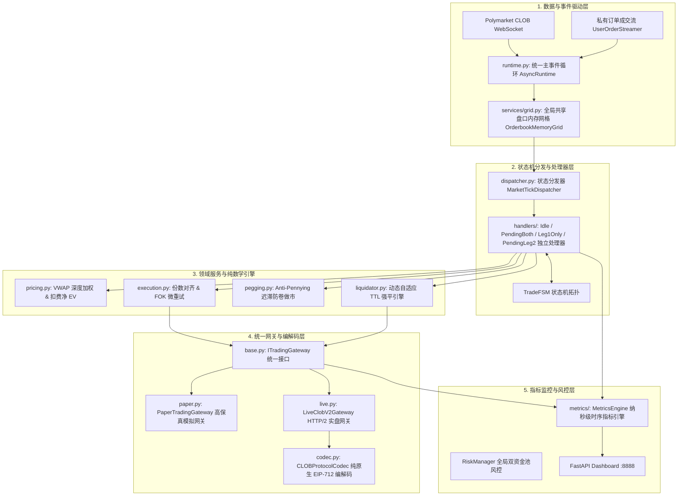

# Polymarket 策略逻辑与架构全景解析 (Architecture Overview)

## 1. 核心架构概述
该机器人是一个针对 Polymarket (CLOB V2) 短期高频市场（例如 5 分钟 BTC/ETH 市场）设计的**自动化量化对冲套利与做市引擎**。
经历全面架构升级后，系统已形成**组件化高内聚、微秒级低延迟、纯无状态领域服务与零外部重量级依赖**的现代化量化体系：



---

## 2. 市场发现与统一主事件循环 (Unified Event Loop)

### 2.1 市场扫描与生命周期
- 机器人通过后台协程/线程定期轮询 Polymarket Gamma API。
- 当扫描到目标 5min 滚动市场时，系统为该市场并发实例化多套不同参数配置的 **策略状态机 (ArbitrageBotFSM)**（如 `taker_maker_conservative`, `maker_maker_standard` 等）。

### 2.2 统一主事件循环与协程工作池 (`AsyncRuntime`)
- 全局维护唯一的长寿命异步事件循环 [`AsyncRuntime`](file:///d:/生活/Trading/polymarket/src/polymarket/runtime.py)，杜绝了“每市场独立线程 + 短命 Loop”的反模式；
- **背压队列 (`BoundedDropOldestQueue`)**：采用定长丢旧保新队列，高频 Tick 到来时自动丢弃滞后旧帧，确保状态机永远消费最新盘口；
- **任务监管器 (`MarketTaskSupervisor`)**：对每个市场监听协程维护强引用防止 GC 意外回收，并在协程崩溃时秒级上报 Dashboard 与重拉。

---

## 3. 全局共享盘口内存网格 (Orderbook Memory Grid)

- **集中式 L2 盘口维护 (`OrderbookMemoryGrid`)**：由单例在内存中维护全部资产的最新买卖盘多档深度；
- **Lock-Free 零锁只读快照**：策略在 Tick 触发时直接获取不可变强类型对象 `OrderbookSnapshot`，读取耗时 `<1微秒`；
- **本地 0 网络 I/O 穿透 VWAP**：在触发强平或开仓测算时，直接穿透本地网格计算加权买盘均价（Bid VWAP），将强平响应耗时从 200ms 降至 `<0.05ms`，彻底杜绝 429 API 频控限流。

---

## 4. 状态处理器架构与 FSM 流转 (State Handlers Pattern)

状态机流转彻底解耦为独立处理器，由 [`MarketTickDispatcher`](file:///d:/生活/Trading/polymarket/src/polymarket/services/handlers/dispatcher.py) 实现 $O(1)$ 注册与分发：

```
[IDLE 监听] 
   │
   ├─► 双挂做市 (Maker-Maker) ─► [PENDING_BOTH_LEGS] ──► 双边均成交 ──► [LOCKED 零暴露完美套利]
   │                                  │
   │                                  ├─► 单边先成交 ──► 立即撤反向单 ──► [LEG1_ONLY 触发 OCO 双向自适应变现]
   │                                  │
   │                                  └─► 临期未成交 (≤30s) ──► 原子撤单 + 释放锁 ──► [FAILED 安全退出]
   │
   ├─► 单腿吃单 (Taker-Maker) ─► [PENDING_LEG1] ─► 成交 ──► [LEG1_ONLY 单腿敞口]
   │                                                       │
   │   ┌───────────────────────────────────────────────────┘
   │   ├─► dual_exit 并发双挂 ─► [PENDING_LEG2] ─► 任意一边成交 ─► 撤销另一单 ─► [LOCKED / SETTLED]
   │   │   • 同向做T卖单 (GTC SELL, 35s 幂律平滑加速让价脱手)
   │   │   • 反向对冲买单 (GTC BUY, 深网低价锁定无风险对冲)
   │   │
   │   └─► 超过动态自适应 TTL ─► 全量撤在途挂单 ─► FOK+GTC 双重兜底平仓 ─► [FAILED 止损退出]
   │
   └─► 盘口到期 ─► [Polygon 链上 35Gwei 自动赎回 Redeem] ─► [SETTLED 终态并无条件归还风控额度]
```

### 4.1 `IdleTickHandler` (开仓四重守门网与机会分流)
- **开盘 15s 绝对静默保护**：当 `time_to_expiry >= 285.0s`（即 5min 盘刚开 $\le 15\text{s}$）时一律静默等待做市商铺单，避开开盘流动性真空；
- **现货 1m 极速动量飞刀拦截 (65% 阈值)**：提取最新 1m 现货 K 线，当 1 分钟位移 $\ge \text{max\_amplitude} \times 0.65$ 时即刻判定为单边剧烈动量冲击，拦截开仓；
- **首腿常规保利与极度超跌做 T 双轨**：常规单强制要求对侧买一 $\ge 0.25$ 且满足净利差；极度超跌单 ($P_1 \le 0.25$) 允许对侧买一 $\ge 0.15$ 放行并标记为 `smart_flip` 智能快速做 T；
- **对侧买盘 OBI 承接厚度壁垒**：吃入首腿前必须验证对侧 Token 前 5 档买盘总有效深度 $\ge 20.0$ 份（约 \$8~\$10 USDC），杜绝二腿挂出后无流动性承接；
- **双做市买一门槛提升至 0.38**：保留的 `maker_maker_conservative` 仅在双边买一 $\ge 0.38$ 时才挂单，杜绝接飞刀；
- **首腿成交就地直通挂二腿 (<5ms)**：私有 WS 捕获成交后，当前协程就地直接调度 `Leg1OnlyTickHandler` 抢占队列优先位。

### 4.2 `PendingBothLegsTickHandler` (双挂做市推进)
- 双边同时成交直接进入 `LOCKED` 锁仓；
- **单边成交自适应脱手**：单腿被吃立即异步撤销反向挂单，精准沉淀 `ctx.leg1` 并流转至 `LEG1_ONLY` 态，自动触发 OCO 双向自适应变现。

### 4.3 `Leg1OnlyTickHandler` (单边持仓与 35s 连续幂律让价)
- 首腿成交后，**严格对齐实际成交份数 (Shares Alignment)**；
- 下发 `dual_exit` OCO 订单，并在 35s 内通过连续幂律函数 $\text{Margin}(t) = \text{InitialMargin} - (t/T)^{1.8} \times (\text{InitialMargin} - \text{MinMargin})$ 实现前期稳润、后期加速脱手，强锁 $\text{Net EV} \ge 0$。

### 4.4 `PendingLeg2TickHandler` (二腿 OCO 变现与 Anti-Pennying 阶梯跟单)
- **OCO 买单 Anti-Pennying 跳跃跟单**：当对侧买一排位被反超且冷却 $\ge 3.0\text{s}$ 时，调用 `MakerPeggingService` 跳跃加价 $0.002\sim 0.004$ 抢占买一，上限严格钳制在净利润 $\ge 0.2\%$ 保利价位；
- **坚守做 T 卖单初始利润**：卖单全程挂在保利目标价，彻底移除临期贱卖打损逻辑；
- **真实损益核算**：二腿成交后立即撤销对侧订单，核算扣除手续费后的净收益并流转 `LOCKED` 或 `SETTLED`。

---

## 5. 统一交易网关抽象 (Unified Trading Gateway)

```
┌────────────────────────────────────────────────────────────────────────┐
│               PolyClient (轻量级透明代理门面 Facade)                    │
└──────────────────────────────────┬─────────────────────────────────────┘
                                   │
                    ┌──────────────┴──────────────┐
                    ▼                             ▼
       ┌─────────────────────────┐   ┌─────────────────────────┐
       │   PaperTradingGateway   │   │    LiveClobV2Gateway    │
       ├─────────────────────────┤   ├─────────────────────────┤
       │ • 模拟订单账本管理      │   │ • HTTP/2 多路复用连接池 │
       │ • 真实网络延迟注入      │   │ • 401 跨秒动态自愈重签  │
       │ • 随机价格滑点仿真      │   │ • 异常 orderID 深度捕获 │
       │ • 纯内存零网络风险      │   │ • 免签 Data API 终极对账│
       └─────────────────────────┘   └────────────┬────────────┘
                                                  ▼
                                     ┌─────────────────────────┐
                                     │    CLOBProtocolCodec    │
                                     │ • 5.0 Shares / 价格钳制 │
                                     │ • 纯原生 EIP-712 签名   │
                                     │ • Wire Payload 结构组装 │
                                     └─────────────────────────┘
```

1. **`CLOBProtocolCodec` (纯无状态编解码器)**：
   - 彻底纯数学化：负责 5.0 Shares 门槛安全钳制、价格区间安全截断、纯原生 EIP-712 Typed Data 计算与 Wire JSON 序列化；
   - 零网络 I/O，支持 100% 内存级离线测试。
2. **`PaperTradingGateway` (高保真模拟网关)**：
   - 内置模拟订单生命周期账本，注入真实随机延迟 (100~300ms) 与价格滑点 (0~0.3%)，彻底杜绝回测假象。
3. **`LiveClobV2Gateway` (纯实盘网关)**：
   - 管理 HTTP/2 多路复用通道，封装 401 动态重签自愈、撮合异常 OrderID 提取与 Data API 终极对账防线。

---

## 6. 轻量级内部时序指标引擎 (Internal Metrics Engine)

系统内置纯原生、零外部重型依赖的 **`MetricsEngine`**：
- **纳秒级打点开销**：采用分片与低锁优化，单次打点耗时 **<100 纳秒**；
- **全链路延迟监控**：通过 Histogram 实时统计下单往返延迟 (`poly_order_latency_seconds`) 与 Tick 处理耗时 (`poly_tick_process_latency_seconds`) 的均值及 P50/P90/P99 百分位数；
- **双模自动计时 (`metrics.timer`)**：同时支持 `with` 与 `async with` 一行代码自动捕获耗时；
- **Dashboard 结构化接口**：通过 `GET /api/metrics` 为 Web 看板提供实时性能与交易时序图表。

---

## 7. 动态自适应强平引擎 (Adaptive TTL)

针对单边库存敞口风险（`LEG1_ONLY`），系统引入多维动态 TTL 调节机制：
* **行情平稳期**：维持基础 `90s`，给二腿挂单留出充足的对手盘撮合与吃单回落时间。
* **高波动联动收紧**：当 K 线振幅接近阈值警戒线（≥70%）时，动态将 TTL 压缩至 `35s ~ 60s` 提前强平逃命。
* **临期截断**：距离到期交割不足 `60s` 时，强制截断至 `max(15s, time_to_expiry - 10s)`，确保在交割前完成离场。
* **单调递减防抖动 (Monotonic TTL)**：持仓期间 TTL 只允许变短，绝不反向延长，彻底消除临界振荡导致的误强平。
* **FOK + GTC 双重止损兜底**：强平前先撤二腿挂单，随后发送市价 FOK 平仓；若 FOK 快速确认未成交，自动以 `GTC @ 0.99` 紧急挂单兜底，杜绝单边遗弃。

---

## 8. 平仓与交割真实盈亏核算体系 (Settlement & Realized PnL)

```mermaid
graph TD
    A[单边持仓触发自适应强平] --> B[撤销二腿未成交挂单]
    B --> C[穿透本地盘口网格深度计算 Bid VWAP 均价]
    C --> D[发送市价 FOK 平仓单]
    
    D -->|✅ 平仓成功| E["生成平仓卖出明细: LegPosition(side='SELL', cost=VWAP)"]
    E --> F["核算 Realized PnL = (close_price - leg1_cost) * size - fees"]
    
    D -->|❌ 平仓失败/临期锁定| G[自动捕获到期最终结算价 settlement_price (1.0 或 0.0)]
    G --> H["核算 Settled PnL = (settlement_price - leg1_cost) * size - entry_fee"]
    
    F --> I[更新 ctx.leg2 为 SELL 明细，精准归档入库与看板]
    H --> I
```

- **真实平仓明细**：强平成功后将 `ctx.leg2` 记录为 `SELL YES @ close_price`，消除此前已被撤销的 `BUY` 挂单残留；
- **终态真实损益核算**：核算扣除双边手续费后的真实净收益并归档入库，杜绝因显示 `$0.0000` 造成的账本失真。
